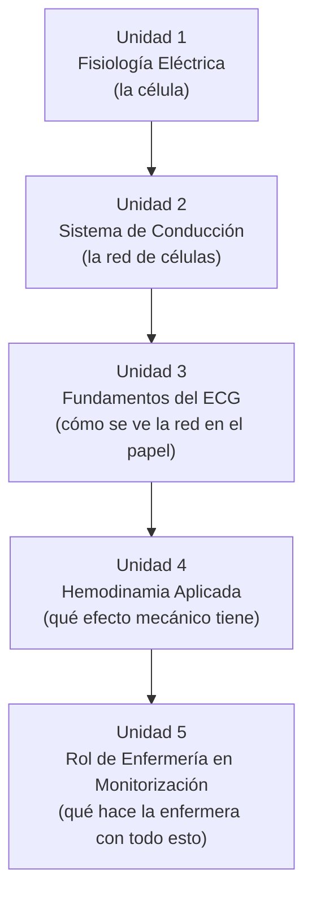
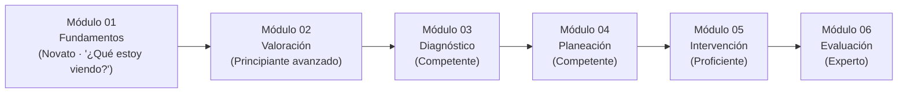

# Arquitectura Pedagógica — Módulo 01: Fundamentos

## Objeto Virtual de Aprendizaje · Manejo Integral de Arritmias Cardíacas

---

## 1. Propósito de este documento

Este documento explica **por qué** el Módulo 01 está diseñado como está: qué modelo pedagógico lo sostiene, cómo se justifica el orden de sus cinco unidades, qué nivel cognitivo exige cada objetivo, y cómo se evalúa el aprendizaje. No es una guía de contenido clínico (eso ya vive en `modules/modulo-01.html`) — es el razonamiento instruccional detrás de esa estructura.

Sirve para tres cosas:

1. Justificar el diseño del Módulo 01 ante la Facultad (para el syllabus y la sustentación del proyecto de grado).
2. Servir de plantilla replicable al documentar la arquitectura de los Módulos 02-06.
3. Detectar inconsistencias entre el diseño pretendido y el contenido real ya implementado.

> **Nota de actualización:** este documento describió originalmente el Módulo 01 en su primera versión (5 unidades con contenido narrativo, pero con el caso clínico, la autoevaluación y la bibliografía todavía sin redactar). Tras un rediseño posterior que añadió recursos interactivos propios del módulo y cerró esas brechas, se actualizó el documento completo — la sección 6.1 y la sección 8 son las que más cambiaron.

---

## 2. Fundamentos pedagógicos que rigen el diseño

El Módulo 01 combina tres marcos de referencia, ya presentes implícitamente en el proyecto:

### 2.1 Modelo de adquisición de competencias de Patricia Benner

Según la tabla de progresión cognitiva del proyecto, el Módulo 01 corresponde al nivel **Novato (Novice)**: el estudiante todavía no tiene experiencia previa de la que partir, y necesita reglas explícitas y context-free antes de poder reconocer patrones.

> Pregunta que domina el pensamiento del estudiante en este módulo: **"¿Qué estoy viendo?"**

Esto tiene una consecuencia directa de diseño: el Módulo 01 **no le pide al estudiante decidir nada clínicamente** (eso empieza en el Módulo 04). Su única exigencia es comprender y reconocer.

### 2.2 Taxonomía de Bloom (revisión de Anderson y Krathwohl)

Cada objetivo de aprendizaje del módulo se ancla a un verbo de un nivel cognitivo específico, y ese nivel determina qué tipo de actividad puede evaluarlo. Ver la tabla completa en la sección 4.

### 2.3 Microestructura pedagógica de cinco pasos (definida en el documento maestro de módulos del proyecto)

Cada unidad del OVA debe seguir, en principio, esta secuencia:

1. **Fundamento científico** — qué es y cómo funciona.
2. **Interpretación clínica** — cómo reconocerlo.
3. **Aplicación práctica** — qué implicaciones tiene para el paciente.
4. **Toma de decisiones** — qué hacer o no hacer.
5. **Caso o simulación** — aplicar el conocimiento.

Como se verá en la sección 6, el Módulo 01 **adapta** deliberadamente esta plantilla: al ser nivel Novato, los pasos 4 y 5 (decisión y simulación) se atenúan a favor de los pasos 1-3, porque la toma de decisiones clínicas reales no es competencia de este módulo.

### 2.4 Capa de interacción activa (añadida en el rediseño)

La primera versión del módulo cubría los pasos 1-3 solo con texto explicativo. El rediseño agrega una capa intermedia —ni evaluación sumativa ni decisión clínica— de **interacción activa**: el estudiante manipula el contenido (construye el potencial de acción paso a paso, recorre el sistema de conducción nodo por nodo, empareja ondas del ECG) antes de llegar a la autoevaluación. Pedagógicamente esto corresponde a la fase de "experimentación concreta" del ciclo de Kolb, adelantada dentro del propio Módulo 01 en vez de reservarse solo para los módulos con simulador (03, 05, 06). El detalle de estos recursos está en la sección 6.1.

---

## 3. Competencia general del Módulo 01: la "puerta de entrada"

El Módulo 01 no enseña a manejar arritmias — enseña el lenguaje eléctrico y gráfico sin el cual ningún otro módulo se puede leer. Es la base común sobre la que se apoyan:

- El **Módulo 02** (Valoración), cuando pide reconocer un ABCDE alterado.
- El **Módulo 03** (Diagnóstico), cuando exige leer P-PR-QRS de un trazado real.
- El **Módulo 04** (Planeación), cuando invoca el mecanismo de reentrada o automatismo.

Por diseño, el Módulo 01 no tiene fase asignada en el Proceso de Atención de Enfermería (PAE) — es fisiología y electrofisiología pura, previa a cualquier valoración de un paciente concreto.

---

## 4. Mapa: Objetivo → Nivel de Bloom → Unidad → Evidencia de evaluación

| # | Objetivo de aprendizaje (tal como aparece en el módulo) | Verbo / Nivel de Bloom | Unidad que lo desarrolla | Evidencia de evaluación actual |
|---|---|---|---|---|
| 1 | Comprender la fisiología eléctrica cardíaca y el potencial de acción celular | **Comprender** | Unidad 1 | Autoevaluación P1 (fase 0); Mini reto de la Unidad 1 (fase 2); stepper "Construye el potencial de acción" |
| 2 | Reconocer la jerarquía del sistema de conducción cardíaco | **Recordar / Comprender** | Unidad 2 | Autoevaluación P2 (frecuencia del nodo AV); diagrama de nodos clicable |
| 3 | Interpretar las ondas e intervalos básicos del ECG normal | **Aplicar** | Unidad 3 | Autoevaluación P3 (significado del QRS ancho); Actividad de aprendizaje; reto de emparejar (ondas ↔ definición) |
| 4 | Relacionar la hemodinamia con la toma de decisiones del algoritmo ACLS | **Analizar** (anticipatorio) | Unidad 4 | Autoevaluación P4 (efecto de la taquicardia extrema sobre el GC) — cierra la brecha original, ver sección 8 |
| 5 | Aplicar los principios de monitorización electrocardiográfica en la práctica de enfermería | **Aplicar** | Unidad 5 | Autoevaluación P5 (acción ante alarma "lead-off") — cierra la brecha original, ver sección 8 |

**Lectura del mapa:** los objetivos suben progresivamente de nivel de Bloom (Comprender → Recordar/Comprender → Aplicar → Analizar → Aplicar). Tras el rediseño, la autoevaluación pasó de 3 a 5 preguntas — una por objetivo — y cada unidad ganó además un instrumento formativo propio (mini reto, stepper, diagrama o actividad de emparejar) que refuerza el objetivo antes de llegar a la autoevaluación final.

---

## 5. Justificación de la secuencia de las cinco unidades

El orden no es arbitrario — cada unidad depende conceptualmente de la anterior:

- **U1 → U2:** no se puede explicar la jerarquía de marcapasos (SA, AV, His-Purkinje) sin antes entender qué es un potencial de acción y por qué una célula puede "generar" un impulso.
- **U2 → U3:** el ECG no es más que el registro en superficie de la despolarización que U2 ya explicó a nivel celular y de conducción — por eso el ECG se enseña después, no antes.
- **U3 → U4:** una vez que el estudiante puede leer el trazado, se le muestra que ese trazado tiene una consecuencia mecánica real (gasto cardíaco) — el puente entre "electricidad" y "paciente".
- **U4 → U5:** cerrando el módulo, se convierte todo lo anterior en una competencia de enfermería aplicable (monitorización), preparando directamente el salto al Módulo 02.

Esta secuencia sigue un patrón **de lo micro a lo macro** (célula → tejido → superficie corporal → mecánica → práctica clínica), coherente con el nivel Novato: cada paso solo añade una capa de abstracción sobre la anterior, nunca dos a la vez.

---

## 6. Microestructura pedagógica aplicada, unidad por unidad

Verificación de la plantilla de 5 pasos (sección 2.3) contra el contenido real de cada unidad:

| Paso de la plantilla | Unidad 1 | Unidad 2 | Unidad 3 | Unidad 4 | Unidad 5 |
|---|---|---|---|---|---|
| 1. Fundamento científico | ✅ Potencial de acción, fases 0/2/3 | ✅ Jerarquía de marcapasos | ✅ Ondas P, PR, QRS, T | ✅ Fórmula GC = FC × VS | ✅ Derivaciones, gestión de alarmas |
| 2. Interpretación clínica | ✅ "Relevancia clínica en arritmias" | ✅ ídem | ✅ ídem + tabla comparativa | ✅ ídem | ✅ ídem |
| 3. Aplicación práctica | ✅ "Aplicación en Enfermería" | ✅ ídem | ✅ ídem | ✅ ídem | ✅ ídem |
| 4. Toma de decisiones | ⚠️ Atenuado (solo alerta clínica, sin decisión activa) | ⚠️ Atenuado | ⚠️ Atenuado | ⚠️ Atenuado | ⚠️ Atenuado |
| 5. Caso o simulación | ➖ No aplica a nivel de unidad (se centraliza al final del módulo) | ➖ | ➖ | ➖ | ➖ |
| 2.4 Interacción activa *(nueva)* | ✅ Stepper de fases + mini reto | ✅ Diagrama de nodos + modelo 3D | ✅ Tabs + reto de emparejar | ➖ (línea de tiempo, sin interacción nueva) | ➖ (acordeón, ya existía) |

**Conclusión:** las tres primeras capas de la plantilla (fundamento, interpretación, aplicación) están sólidamente implementadas en las cinco unidades, con el patrón visual consistente de `key-box` (concepto clave) + `key-box danger` (alerta clínica). La capa 4 (decisión) se atenúa deliberadamente — coherente con el nivel Novato, que no debe todavía "decidir" clínicamente. La capa 5 (caso/simulación) se centraliza al final del módulo, no unidad por unidad, lo cual es una decisión de diseño razonable para no fragmentar el caso clínico en cinco mini-casos. La nueva capa de interacción activa se concentró en las Unidades 1-3 (donde el contenido se presta mejor a manipulación directa: fases secuenciales, jerarquía de nodos, emparejamiento de conceptos); las Unidades 4 y 5 se reforzaron con recursos formativos existentes (perla clínica, error frecuente, dato curioso, caja de éxito) en vez de forzar un widget nuevo donde no aportaba valor pedagógico claro.

### 6.1 Recursos interactivos propios del módulo

Antes del rediseño, la única interacción del Módulo 01 era el acordeón de preguntas frecuentes (Unidad 5). El rediseño agregó cuatro recursos genéricos y reutilizables (definidos en `css/10-componentes.css` y `js/12-widgets-aprendizaje.js`, no específicos de este módulo):

- **Stepper de fases** (Unidad 1): recorrido secuencial de las 5 fases del potencial de acción. Cada fase pre-escrita en HTML explica el evento iónico y "por qué le importa a enfermería" — decisión deliberada para que el widget muestre/oculte contenido curado, no para que genere texto dinámicamente.
- **Diagrama de nodos clicable** (Unidad 2): jerarquía SA→AV→His→Purkinje, cada nodo revela su ficha (frecuencia intrínseca, rol, qué pasa si falla). Acompañado del modelo 3D real del corazón (`assets/models/Heart.glb`, el mismo asset ya usado en el home) — con un caption que aclara honestamente que el modelo es anatómico general y no marca las vías de conducción, para no sugerir una precisión que el asset no tiene.
- **Tabs** (Unidad 3): separa derivaciones bipolares de unipolares sin sobrecargar la unidad con texto continuo.
- **Reto de emparejar** (Unidad 3): asocia cada onda del ECG con su definición. Se implementó como "toca para emparejar" (clic en término, luego en definición) en vez de arrastrar y soltar nativo de HTML5 — el drag-and-drop tiene soporte táctil pobre y es poco accesible por teclado, lo cual entra en conflicto directo con los requisitos de responsive/accesibilidad del proyecto (`docs/CLAUDE.md`). Los mismos botones nativos dan accesibilidad de teclado (Tab + Enter) sin esfuerzo adicional.
- **Mini reto** (Unidad 1, y reutilizable en cualquier unidad futura): una micro-pregunta de retroalimentación inmediata, distinta de la Actividad de aprendizaje que cierra el módulo — refuerza un concepto puntual sin esperar hasta el final.

Los cuatro widgets comparten el mismo principio de diseño: la respuesta correcta o el contenido de cada paso vive en el HTML (atributos `data-correcta`, o paneles pre-escritos), y el JavaScript solo la lee — nunca la genera ni la inventa. Esto mantiene el contenido clínico auditable y editable sin tocar código.

---

## 7. Estrategia de evaluación multinivel

El módulo evalúa en tres momentos distintos, con tres propósitos distintos:

| Instrumento | Momento | Propósito pedagógico | Nivel de Bloom que mide |
|---|---|---|---|
| `key-box` / `key-box danger` (dentro de cada unidad) | Formativo, in-line | Refuerzo inmediato del concepto justo donde aparece — sin calificación | Recordar / Comprender |
| Mini reto, stepper, diagrama de nodos, reto de emparejar (sección 6.1) | Formativo, in-line, con retroalimentación real (✅/❌) | Manipulación activa del contenido antes de la evaluación final | Comprender / Aplicar |
| Actividad de aprendizaje (1 pregunta) | Al cierre del desarrollo, antes del resumen | Chequeo rápido de un concepto puntual | Aplicar |
| Caso clínico | Antes de la autoevaluación | Integración de varias unidades en un escenario único, estrictamente de reconocimiento (nunca "qué haría usted") | Aplicar / Analizar |
| Autoevaluación (5 preguntas, una por objetivo) | Cierre del módulo | Verificación sumativa-formativa (intentos ilimitados, retroalimentación real por pregunta vía `verificarAutoevaluacion`) de los 5 objetivos | Recordar / Comprender / Aplicar / Analizar |

Este diseño en capas es coherente con el ciclo de aprendizaje experiencial (Kolb): concepto → interacción activa (sección 6.1) → aplicación integrada (caso) → verificación (autoevaluación) — el Módulo 01 ya incorpora su propia fase de "experimentación concreta" a menor escala, antes de la experimentación con datos clínicos reales que exigirán los módulos con simulador (03, 05, 06).

---

## 8. Brechas detectadas y su resolución

Esta sección documentaba originalmente 4 inconsistencias entre el diseño pretendido y el contenido real de `modules/modulo-01.html`. Las 4 se cerraron en el rediseño posterior — se conservan aquí, marcadas como resueltas, para dejar registro de la iteración (útil para la sustentación del proyecto de grado):

1. **✅ Resuelto — Caso clínico sin redactar.** Los cinco campos y las preguntas del caso ahora tienen contenido real: un paciente con palpitaciones y antecedente de consumo elevado de cafeína, con preguntas de reconocimiento (no de decisión clínica) que remiten explícitamente a las Unidades 1, 2 y 4.
2. **✅ Resuelto — Autoevaluación con enunciados sin redactar.** Las 3 preguntas originales se reescribieron sin texto de relleno, y se agregaron 2 preguntas nuevas (P4 y P5).
3. **✅ Resuelto — Bibliografía genérica.** Se reemplazó por 5 fuentes reales y reconocibles: Guyton & Hall (Unidad 1), Goldberger (Unidad 3), Braunwald (referencia general), guías AHA (Unidad 4) y AACN Practice Alert sobre fatiga de alarmas (Unidad 5).
4. **✅ Resuelto — Objetivos 4 y 5 sin instrumento de evaluación propio.** La autoevaluación pasó de 3 a 5 preguntas; P4 mide directamente el objetivo 4 (efecto de la taquicardia extrema sobre el gasto cardíaco) y P5 mide el objetivo 5 (acción correcta ante una alarma de "lead-off").

Como efecto colateral de este trabajo se encontró y corrigió además un bug real, presente en los 6 módulos de la OVA (no solo en el Módulo 01): el botón "Enviar respuestas" llamaba a una función (`verificarActividad`) que buscaba un contenedor (`.modulo-actividad`) del que `.modulo-autoevaluacion` no es descendiente sino hermano — lo que producía un `TypeError` en consola en vez de validar nada. Se separó en `verificarActividad` (sin cambios) y una nueva `verificarAutoevaluacion` que sí opera sobre `.modulo-autoevaluacion` y dota de retroalimentación real por pregunta.

---

## 9. Relación con el resto de la OVA

El Módulo 01 no se evalúa a sí mismo como un fin — su éxito real se mide indirectamente en los módulos siguientes: si un estudiante llega al Módulo 03 y no puede identificar un QRS ancho, la falla no está en el Módulo 03, está en que el Módulo 01 no logró consolidar el objetivo 3. Por eso cualquier revisión futura del Módulo 01 debería validarse preguntando: *¿este cambio hace más probable que el estudiante tenga éxito en el Módulo 02 y 03?*
