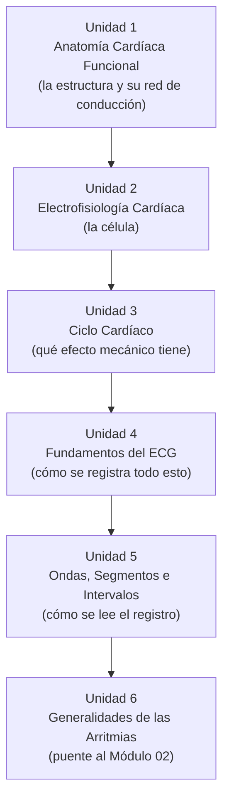
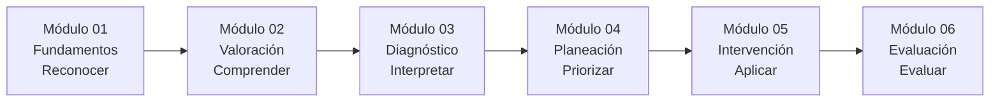

# Arquitectura Pedagógica — Módulo 01: Fundamentos

## Objeto Virtual de Aprendizaje · Manejo Integral de Arritmias Cardíacas

---

## 1. Propósito de este documento

Este documento explica **por qué** el Módulo 01 está diseñado como está: qué modelo pedagógico lo sostiene, cómo se justifica el orden de sus seis unidades, qué nivel cognitivo exige cada objetivo, y cómo se evalúa el aprendizaje. No es una guía de contenido clínico (eso vive en `modules/modulo-01.html`) — es el razonamiento instruccional detrás de esa estructura.

Sirve para tres cosas:

1. Justificar el diseño del Módulo 01 ante la Facultad (para el syllabus y la sustentación del proyecto de grado).
2. Servir de plantilla replicable para los Módulos 02-06, documentados en esta misma carpeta.
3. Detectar inconsistencias entre el diseño pretendido y el contenido real ya implementado.

> **Nota de actualización (v4).** Esta versión introduce dos cambios de fondo:
>
> 1. **De 7 a 6 unidades.** «Sistema de Conducción», que era la Unidad 3, se absorbe en la Unidad 1 (Anatomía Cardíaca Funcional).
> 2. **Se retira el modelo de Benner como escala operativa.** Los niveles ya no son novato/principiante avanzado/competente, sino **niveles de complejidad del aprendizaje**: reconocer, comprender, interpretar, priorizar, aplicar y evaluar. La razón se explica en la sección 2.1.
>
> **Brecha de implementación abierta:** `modules/modulo-01.html` todavía contiene **7 unidades, 7 objetivos y 7 preguntas** de autoevaluación. Este documento describe la estructura aprobada, no la implementada. Ver sección 8.

---

## 2. Fundamentos pedagógicos que rigen el diseño

### 2.1 Niveles de complejidad del aprendizaje (y por qué ya no Benner)

Las versiones anteriores de este documento anclaban cada módulo a un nivel del modelo de adquisición de competencias de Patricia Benner: el Módulo 01 era «Novato», el 06 era «Experto».

Ese anclaje se retiró por una razón de honestidad metodológica. Benner sostiene que el tránsito de novato a experto **depende de la experiencia clínica real acumulada en el tiempo**, no de la exposición a contenido. Afirmar que un recurso educativo digital lleva a un estudiante de novato a experto es una promesa que el recurso no puede cumplir, y es indefendible ante un jurado: nada garantiza que quien complete el OVA sepa interpretar un trazado real en una unidad de cuidado intensivo, donde intervienen factores que ningún simulador reproduce.

Benner **se conserva como referente teórico orientador** del diseño: es la razón por la que el curso avanza de lo simple a lo complejo y por la que la práctica pesa más que la exposición. Pero la escala operativa —la que aparece en las tablas y la que se puede verificar— es la de niveles de complejidad del aprendizaje:

| Módulo | Nivel de complejidad | Pregunta que domina el pensamiento del estudiante |
|---|---|---|
| **01 Fundamentos** | **Reconocer** | **¿Qué estoy viendo?** |
| 02 Valoración | Comprender | ¿Cómo está el paciente? |
| 03 Diagnóstico | Interpretar | ¿Qué ritmo es? |
| 04 Planeación | Priorizar | ¿Qué hago primero? |
| 05 Intervención | Aplicar | ¿Cómo lo hago? |
| 06 Evaluación | Evaluar | ¿Funcionó? |

Esto tiene una consecuencia directa de diseño: el Módulo 01 **no le pide al estudiante decidir nada clínicamente** (eso empieza en el Módulo 04). Su única exigencia es reconocer y comprender.

### 2.2 Taxonomía de Bloom (revisión de Anderson y Krathwohl)

Cada objetivo de aprendizaje se ancla a un verbo de un nivel cognitivo específico, y ese nivel determina qué tipo de actividad puede evaluarlo. Ver la tabla completa en la sección 4.

Los niveles de complejidad de la sección 2.1 y los de Bloom no son lo mismo ni compiten entre sí: los primeros ordenan **los módulos entre sí**; Bloom clasifica **cada objetivo** dentro de un módulo. Un módulo de nivel «reconocer» puede contener un objetivo puntual de nivel «aplicar», como ocurre aquí con el cálculo de la frecuencia cardíaca.

### 2.3 Microestructura pedagógica de cinco pasos

Cada unidad del OVA debe seguir, en principio, esta secuencia:

1. **Fundamento científico** — qué es y cómo funciona.
2. **Interpretación clínica** — cómo reconocerlo.
3. **Aplicación práctica** — qué implicaciones tiene para el paciente.
4. **Toma de decisiones** — qué hacer o no hacer.
5. **Caso o simulación** — aplicar el conocimiento.

Como se ve en la sección 6, el Módulo 01 **adapta** deliberadamente esta plantilla: al ser el nivel de entrada, los pasos 4 y 5 se atenúan a favor de los pasos 1-3, porque la toma de decisiones clínicas no es competencia de este módulo.

### 2.4 Capa de interacción activa

Entre la explicación y la evaluación hay una capa intermedia —ni evaluación sumativa ni decisión clínica— de **interacción activa**: el estudiante manipula el contenido (construye el potencial de acción paso a paso, recorre el sistema de conducción nodo por nodo, empareja ondas del ECG) antes de llegar a la autoevaluación. Corresponde a la fase de «experimentación concreta» del ciclo de Kolb, adelantada dentro del propio Módulo 01 en vez de reservarse solo para los módulos con simulador (03, 05, 06). Detalle en la sección 6.1.

---

## 3. Competencia general del Módulo 01: la «puerta de entrada»

El Módulo 01 no enseña a manejar arritmias — enseña el lenguaje eléctrico y gráfico sin el cual ningún otro módulo se puede leer. Es la base común sobre la que se apoyan:

- El **Módulo 02** (Valoración), cuando pide reconocer un ABCDE alterado.
- El **Módulo 03** (Diagnóstico), cuando exige leer P-PR-QRS de un trazado real.
- El **Módulo 04** (Planeación), cuando invoca el mecanismo de reentrada o el automatismo.

Por diseño, el Módulo 01 no tiene fase asignada en el Proceso de Atención de Enfermería (PAE) — es fisiología y electrofisiología pura, previa a cualquier valoración de un paciente concreto.

---

## 4. Mapa: Objetivo → Nivel de Bloom → Unidad → Evidencia de evaluación

| # | Objetivo de aprendizaje | Verbo / Nivel de Bloom | Unidad que lo desarrolla | Evidencia de evaluación |
|---|---|---|---|---|
| 1 | Describir la anatomía funcional del corazón (cavidades, válvulas, irrigación coronaria) y la organización anatómica y jerárquica del sistema de conducción | **Recordar / Comprender** | Unidad 1 · Anatomía Cardíaca Funcional | Modelo 3D del corazón; diagrama de nodos clicable; pregunta 1 de autoevaluación |
| 2 | Comprender la electrofisiología celular cardíaca: potencial de acción, automatismo, excitabilidad, conductividad y refractariedad | **Comprender** | Unidad 2 · Electrofisiología Cardíaca | Stepper «Construye el potencial de acción»; mini reto (fase 2); pregunta 2 |
| 3 | Relacionar el ciclo cardíaco con la actividad eléctrica que lo desencadena | **Analizar** | Unidad 3 · Ciclo Cardíaco | Tabla comparativa sístole/diástole; pregunta 3 |
| 4 | Explicar los fundamentos del registro electrocardiográfico, incluyendo el cálculo de la frecuencia cardíaca y la determinación del eje eléctrico | **Aplicar** | Unidad 4 · Fundamentos del ECG | Tabs de derivaciones; mini reto de cálculo de FC; simulador de eje eléctrico; pregunta 4 |
| 5 | Identificar las ondas, segmentos e intervalos normales del ECG | **Aplicar** | Unidad 5 · Ondas, Segmentos e Intervalos | Reto de emparejar (5 pares); actividad de aprendizaje; pregunta 5 |
| 6 | Reconocer las generalidades de las arritmias cardíacas como puente hacia la valoración clínica | **Comprender / Analizar** (anticipatorio) | Unidad 6 · Generalidades de las Arritmias | Tabla comparativa de clasificación; pregunta 6 |

**Lectura del mapa:** la correspondencia es 1:1 entre unidad, objetivo y pregunta de autoevaluación. Este principio —que ningún objetivo quede sin instrumento propio— es el criterio de calidad que los Módulos 02-05 todavía no cumplen (ver el cuadro comparativo en cada uno de sus documentos).

**Consecuencia de la fusión:** el objetivo que antes decía «Reconocer la jerarquía funcional del sistema de conducción» desaparece como objetivo independiente y se integra en el objetivo 1. Conviene tenerlo presente al redactar la Unidad 1: la jerarquía de marcapasos (frecuencias intrínsecas del nodo SA, el nodo AV y el sistema His-Purkinje, y qué ocurre cuando uno falla) es contenido **funcional**, no anatómico. Al vivir dentro de una unidad titulada «Anatomía», corre el riesgo de quedar reducida a una lista de ubicaciones. La redacción debe cubrir explícitamente el comportamiento de la jerarquía, no solo su localización.

---

## 5. Justificación de la secuencia de las seis unidades

- **U1 → U2:** primero el mapa físico —cavidades, válvulas, irrigación y el trayecto del sistema de conducción—, después la célula que genera el impulso. Se puede señalar dónde está el nodo sinusal antes de explicar por qué se despolariza solo.
- **U2 → U3:** entendida la conducción eléctrica, se muestra su consecuencia mecánica inmediata: la despolarización dispara la contracción y la repolarización coincide con la relajación.
- **U3 → U4:** el ciclo cardíaco (mecánico) y la conducción (eléctrica) son exactamente lo que el ECG registra desde la superficie corporal — por eso el ECG se enseña después de entender qué produce la señal, no antes.
- **U4 → U5:** una vez que el estudiante sabe qué es el papel milimetrado, cómo se calcula la frecuencia y cómo se determina el eje, puede nombrar cada onda, segmento e intervalo.
- **U5 → U6:** con el ECG normal dominado, la unidad de cierre introduce qué es y cómo se clasifica una arritmia — sin pedir todavía ninguna decisión clínica.

El patrón es **de lo estructural a lo funcional, y de lo funcional al registro**: anatomía y red de conducción → célula → mecánica → registro → lectura → generalización patológica. Cada paso añade una sola capa de abstracción sobre la anterior, que es lo que exige el nivel «reconocer».

**Coste de la fusión:** la secuencia anterior de siete unidades tenía una progresión más gradual en el arranque (dónde está → cómo funciona la célula → cómo funciona la red). Al fundir anatomía y conducción en una sola unidad, la Unidad 1 concentra más carga cognitiva que las demás. Compensarlo es responsabilidad de la redacción: conviene separar internamente el bloque anatómico del bloque de jerarquía funcional con subtítulos claros, para que el estudiante no reciba las dos capas como un bloque único.

---

## 6. Microestructura pedagógica aplicada, unidad por unidad

| Paso de la plantilla | U1 Anatomía + Conducción | U2 Electrofisiología | U3 Ciclo Cardíaco | U4 Fundamentos ECG | U5 Ondas/Segmentos | U6 Generalidades |
|---|---|---|---|---|---|---|
| 1. Fundamento científico | ✅ Cavidades, válvulas, irrigación, jerarquía de nodos | ✅ Potencial de acción, 4 propiedades | ✅ Sístole/diástole | ✅ Qué registra, derivaciones, papel, eje | ✅ P, PR, QRS, ST, T, QT, U | ✅ Definición y clasificación |
| 2. Interpretación clínica | ✅ Relevancia clínica (IAM y coronarias) | ✅ | ✅ | ✅ | ✅ | ✅ |
| 3. Aplicación práctica | ➖ (se traslada a la exploración 3D) | ✅ | ➖ | ✅ | ➖ | ➖ |
| 4. Toma de decisiones | ⚠️ Atenuado | ⚠️ Atenuado | ⚠️ Atenuado | ⚠️ Atenuado | ⚠️ Atenuado | ⚠️ Atenuado (mecanismos, sin decidir tratamiento) |
| 5. Caso o simulación | ➖ Centralizado al final del módulo | ➖ | ➖ | ➖ | ➖ | ➖ |
| 2.4 Interacción activa | ✅ Modelo 3D + diagrama de nodos | ✅ Stepper + mini reto | ➖ (tabla comparativa) | ✅ Tabs + mini reto + simulador de eje | ✅ Reto de emparejar (5 pares) | ➖ (tabla de clasificación) |

**Conclusión:** la capa 4 (decisión) sigue atenuada deliberadamente en todas las unidades — el Módulo 04 es quien exige análisis de mecanismos para decidir tratamiento. La interacción activa cubre 4 de las 6 unidades (1, 2, 4, 5), más las tablas comparativas de las Unidades 3 y 6, que cumplen una función equivalente de síntesis visual sin requerir un widget dedicado.

### 6.1 Recursos interactivos propios del módulo

Los widgets genéricos viven en `css/10-componentes.css` y `js/12-widgets-aprendizaje.js`; no son específicos de este módulo.

- **Modelo 3D del corazón** (`assets/models/Heart.glb`, Unidad 1): modelo anatómico general. El caption es honesto: **no marca las vías de conducción**.
- **Identificación de estructuras** (Unidad 1): hotspots sobre la imagen anatómica para nombrar cavidades y estructuras.
- **Diagrama de nodos clicable** (Unidad 1, antes en la Unidad 3): jerarquía funcional SA→AV→His→Purkinje con frecuencia intrínseca, rol y consecuencia del fallo. Es el recurso que sostiene la parte funcional del objetivo 1 tras la fusión — sin él, la unidad quedaría puramente descriptiva.
- **Stepper de fases** (Unidad 2): las 5 fases del potencial de acción, cada una ligada a una de las 4 propiedades eléctricas.
- **Tabs** (Unidad 4): separa derivaciones bipolares de unipolares.
- **Simulador de eje eléctrico** (Unidad 4): herramienta externa integrada (ver `docs/CREDITOS-TERCEROS.md`).
- **Mini retos** (Unidades 2 y 4): fase 2 del potencial de acción; cálculo de frecuencia cardíaca con cuadros grandes entre ondas R.
- **Reto de emparejar** (Unidad 5): 5 pares, incluyendo segmento ST e intervalo QT. Usa «toca para emparejar» en vez de arrastrar y soltar nativo, por accesibilidad táctil y de teclado (`docs/CLAUDE.md`).

Todos comparten el mismo principio: la respuesta correcta vive en el HTML (atributos `data-correcta`, paneles pre-escritos) y el JavaScript solo la lee — nunca la genera.

---

## 7. Estrategia de evaluación multinivel

| Instrumento | Momento | Propósito pedagógico | Nivel de Bloom que mide |
|---|---|---|---|
| `key-box` / `key-box danger` | Formativo, in-line | Refuerzo inmediato del concepto donde aparece — sin calificación | Recordar / Comprender |
| Mini reto, stepper, diagrama de nodos, reto de emparejar | Formativo, in-line, con retroalimentación real (✅/❌) | Manipulación activa antes de la evaluación | Comprender / Aplicar |
| Actividad de aprendizaje (1 pregunta) | Al cierre del desarrollo | Chequeo rápido de un concepto puntual | Aplicar |
| Caso clínico | Antes de la autoevaluación | Integración de varias unidades, estrictamente de reconocimiento (nunca «qué haría usted») | Aplicar / Analizar |
| Autoevaluación (6 preguntas, una por objetivo) | Cierre del módulo | Verificación sumativa-formativa con intentos ilimitados y retroalimentación por pregunta (`verificarAutoevaluacion`) | Recordar → Analizar |

Coherente con el ciclo de Kolb: concepto → interacción activa → aplicación integrada (caso) → verificación. El Módulo 01 incorpora su propia fase de «experimentación concreta» antes de la que exigirán los módulos con simulador.

---

## 8. Historial de brechas y decisiones de rediseño

**v1 → v2 (5 unidades, contenido completo):** se cerraron 4 brechas — caso clínico sin redactar, autoevaluación con enunciados de relleno, bibliografía genérica, y objetivos sin instrumento propio. Como efecto colateral se corrigió un bug presente en los 6 módulos: «Enviar respuestas» llamaba a `verificarActividad`, que buscaba un contenedor (`.modulo-actividad`) del que `.modulo-autoevaluacion` no es descendiente sino hermano, produciendo un `TypeError`. Se separó en `verificarActividad` y `verificarAutoevaluacion`.

**v2 → v3 (7 unidades):** la Facultad indicó seguir la estructura oficial del syllabus. Se agregaron Anatomía Cardíaca Funcional y Ciclo Cardíaco; se eliminaron «Hemodinamia Aplicada» y «Rol de Enfermería en Monitorización» (ya cubiertos por el Módulo 02); «Fundamentos del ECG» se dividió en dos unidades; se añadió Generalidades de las Arritmias como cierre.

**v3 → v4 (6 unidades y niveles de complejidad, esta versión):**

- **Fusión de unidades:** «Sistema de Conducción» deja de ser unidad independiente y se integra en «Anatomía Cardíaca Funcional». Los objetivos pasan de 7 a 6 y la autoevaluación de 7 a 6 preguntas. Ningún recurso interactivo se descarta: el diagrama de nodos se reubica en la Unidad 1.
- **Cambio de escala:** se retira Benner como escala operativa y se adopta la de niveles de complejidad del aprendizaje. Razón en la sección 2.1. Afecta a los seis módulos y a la Tabla 1 del artículo del proyecto.

**Brechas abiertas al cierre de esta versión:**

| Brecha | Estado |
|---|---|
| `modules/modulo-01.html` sigue con 7 unidades, 7 objetivos y 7 preguntas | 🔴 Abierta — este documento describe la estructura aprobada, no la implementada |
| La jerarquía funcional del sistema de conducción queda dentro de una unidad titulada «Anatomía» | ⚠️ Riesgo de redacción — ver nota en la sección 4 |
| El bloque de ECG diagnóstico del syllabus (crecimiento de cavidades, isquemia, bloqueos de rama, alteraciones electrolíticas) no aparece en ningún módulo | ⚠️ Por confirmar con la asesora si entra en el alcance |

---

## 9. Relación con el resto de la OVA

El Módulo 01 no se evalúa a sí mismo como un fin — su éxito se mide indirectamente en los módulos siguientes: si un estudiante llega al Módulo 03 y no puede identificar un QRS ancho, la falla no está en el Módulo 03, está en que el Módulo 01 no consolidó su objetivo 5. Por eso cualquier revisión futura debería validarse preguntando: *¿este cambio hace más probable que el estudiante tenga éxito en los Módulos 02 y 03?*
