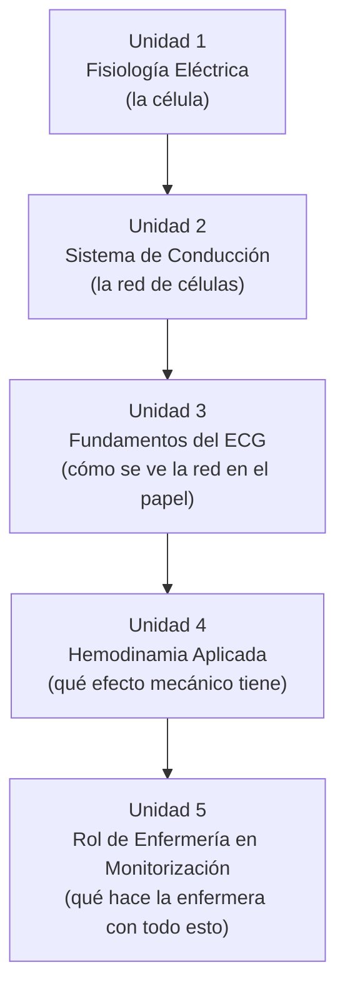
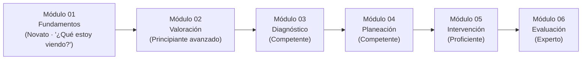

# Arquitectura Pedagógica — Módulo 01: Fundamentos

## Objeto Virtual de Aprendizaje · Manejo Integral de Arritmias Cardíacas

---

## 1. Propósito de este documento

Este documento explica **por qué** el Módulo 01 está diseñado como está: qué modelo pedagógico lo sostiene, cómo se justifica el orden de sus cinco unidades, qué nivel cognitivo exige cada objetivo, y cómo se evalúa el aprendizaje. No es una guía de contenido clínico (eso ya vive en `modules/modulo-01.html`) — es el razonamiento instruccional detrás de esa estructura.

Sirve para tres cosas:

1. Justificar el diseño del Módulo 01 ante la Facultad (para el syllabus y la sustentación del proyecto de grado).
2. Servir de plantilla replicable al documentar la arquitectura de los Módulos 02-06.
3. Detectar inconsistencias entre el diseño pretendido y el contenido real ya implementado.

---

## 2. Fundamentos pedagógicos que rigen el diseño

El Módulo 01 combina tres marcos de referencia, ya presentes implícitamente en el proyecto:

### 2.1 Modelo de adquisición de competencias de Patricia Benner

Según la tabla de progresión cognitiva del proyecto, el Módulo 01 corresponde al nivel **Novato (Novice)**: el estudiante todavía no tiene experiencia previa de la que partir, y necesita reglas explícitas y context-free antes de poder reconocer patrones.

> Pregunta que domina el pensamiento del estudiante en este módulo: **"¿Qué estoy viendo?"**

Esto tiene una consecuencia directa de diseño: el Módulo 01 **no le pide al estudiante decidir nada clínicamente** (eso empieza en el Módulo 04). Su única exigencia es comprender y reconocer.

### 2.2 Taxonomía de Bloom (revisión de Anderson y Krathwohl)

Cada objetivo de aprendizaje del módulo se ancla a un verbo de un nivel cognitivo específico, y ese nivel determina qué tipo de actividad puede evaluarlo. Ver la tabla completa en la sección 4.

### 2.3 Microestructura pedagógica de cinco pasos (definida en el documento maestro de módulos del proyecto)

Cada unidad del OVA debe seguir, en principio, esta secuencia:

1. **Fundamento científico** — qué es y cómo funciona.
2. **Interpretación clínica** — cómo reconocerlo.
3. **Aplicación práctica** — qué implicaciones tiene para el paciente.
4. **Toma de decisiones** — qué hacer o no hacer.
5. **Caso o simulación** — aplicar el conocimiento.

Como se verá en la sección 6, el Módulo 01 **adapta** deliberadamente esta plantilla: al ser nivel Novato, los pasos 4 y 5 (decisión y simulación) se atenúan a favor de los pasos 1-3, porque la toma de decisiones clínicas reales no es competencia de este módulo.

---

## 3. Competencia general del Módulo 01: la "puerta de entrada"

El Módulo 01 no enseña a manejar arritmias — enseña el lenguaje eléctrico y gráfico sin el cual ningún otro módulo se puede leer. Es la base común sobre la que se apoyan:

- El **Módulo 02** (Valoración), cuando pide reconocer un ABCDE alterado.
- El **Módulo 03** (Diagnóstico), cuando exige leer P-PR-QRS de un trazado real.
- El **Módulo 04** (Planeación), cuando invoca el mecanismo de reentrada o automatismo.

Por diseño, el Módulo 01 no tiene fase asignada en el Proceso de Atención de Enfermería (PAE) — es fisiología y electrofisiología pura, previa a cualquier valoración de un paciente concreto.

---

## 4. Mapa: Objetivo → Nivel de Bloom → Unidad → Evidencia de evaluación

| # | Objetivo de aprendizaje (tal como aparece en el módulo) | Verbo / Nivel de Bloom | Unidad que lo desarrolla | Evidencia de evaluación actual |
|---|---|---|---|---|
| 1 | Comprender la fisiología eléctrica cardíaca y el potencial de acción celular | **Comprender** | Unidad 1 | Autoevaluación P1 (fase de despolarización) |
| 2 | Reconocer la jerarquía del sistema de conducción cardíaco | **Recordar / Comprender** | Unidad 2 | Autoevaluación P2 (frecuencia del nodo AV) |
| 3 | Interpretar las ondas e intervalos básicos del ECG normal | **Aplicar** | Unidad 3 | Autoevaluación P3 (significado del QRS ancho); Actividad de aprendizaje |
| 4 | Relacionar la hemodinamia con la toma de decisiones del algoritmo ACLS | **Analizar** (anticipatorio) | Unidad 4 | *Sin instrumento propio — ver hallazgo en sección 8* |
| 5 | Aplicar los principios de monitorización electrocardiográfica en la práctica de enfermería | **Aplicar** | Unidad 5 | *Sin instrumento propio — ver hallazgo en sección 8* |

**Lectura del mapa:** los objetivos suben progresivamente de nivel de Bloom (Comprender → Recordar/Comprender → Aplicar → Analizar → Aplicar), pero la evaluación real solo cubre los tres primeros. Los objetivos 4 y 5 —los dos más avanzados— no tienen ninguna pregunta de autoevaluación que los mida directamente. Esto es una brecha de alineación (objetivo vs. evaluación), documentada en la sección 8.

---

## 5. Justificación de la secuencia de las cinco unidades

El orden no es arbitrario — cada unidad depende conceptualmente de la anterior:

- **U1 → U2:** no se puede explicar la jerarquía de marcapasos (SA, AV, His-Purkinje) sin antes entender qué es un potencial de acción y por qué una célula puede "generar" un impulso.
- **U2 → U3:** el ECG no es más que el registro en superficie de la despolarización que U2 ya explicó a nivel celular y de conducción — por eso el ECG se enseña después, no antes.
- **U3 → U4:** una vez que el estudiante puede leer el trazado, se le muestra que ese trazado tiene una consecuencia mecánica real (gasto cardíaco) — el puente entre "electricidad" y "paciente".
- **U4 → U5:** cerrando el módulo, se convierte todo lo anterior en una competencia de enfermería aplicable (monitorización), preparando directamente el salto al Módulo 02.

Esta secuencia sigue un patrón **de lo micro a lo macro** (célula → tejido → superficie corporal → mecánica → práctica clínica), coherente con el nivel Novato: cada paso solo añade una capa de abstracción sobre la anterior, nunca dos a la vez.

---

## 6. Microestructura pedagógica aplicada, unidad por unidad

Verificación de la plantilla de 5 pasos (sección 2.3) contra el contenido real de cada unidad:

| Paso de la plantilla | Unidad 1 | Unidad 2 | Unidad 3 | Unidad 4 | Unidad 5 |
|---|---|---|---|---|---|
| 1. Fundamento científico | ✅ Potencial de acción, fases 0/2/3 | ✅ Jerarquía de marcapasos | ✅ Ondas P, PR, QRS, T | ✅ Fórmula GC = FC × VS | ✅ Derivaciones, gestión de alarmas |
| 2. Interpretación clínica | ✅ "Relevancia clínica en arritmias" | ✅ ídem | ✅ ídem + tabla comparativa | ✅ ídem | ✅ ídem |
| 3. Aplicación práctica | ✅ "Aplicación en Enfermería" | ✅ ídem | ✅ ídem | ✅ ídem | ✅ ídem |
| 4. Toma de decisiones | ⚠️ Atenuado (solo alerta clínica, sin decisión activa) | ⚠️ Atenuado | ⚠️ Atenuado | ⚠️ Atenuado | ⚠️ Atenuado |
| 5. Caso o simulación | ➖ No aplica a nivel de unidad (se centraliza al final del módulo) | ➖ | ➖ | ➖ | ➖ |

**Conclusión:** las tres primeras capas de la plantilla (fundamento, interpretación, aplicación) están sólidamente implementadas en las cinco unidades, con el patrón visual consistente de `key-box` (concepto clave) + `key-box danger` (alerta clínica). La capa 4 (decisión) se atenúa deliberadamente — coherente con el nivel Novato, que no debe todavía "decidir" clínicamente. La capa 5 (caso/simulación) se centraliza al final del módulo, no unidad por unidad, lo cual es una decisión de diseño razonable para no fragmentar el caso clínico en cinco mini-casos.

---

## 7. Estrategia de evaluación multinivel

El módulo evalúa en tres momentos distintos, con tres propósitos distintos:

| Instrumento | Momento | Propósito pedagógico | Nivel de Bloom que mide |
|---|---|---|---|
| `key-box` / `key-box danger` (dentro de cada unidad) | Formativo, in-line | Refuerzo inmediato del concepto justo donde aparece — sin calificación | Recordar / Comprender |
| Actividad de aprendizaje (1 pregunta) | Al cierre del desarrollo, antes del resumen | Chequeo rápido de un concepto puntual | Aplicar |
| Caso clínico | Antes de la autoevaluación | Integración de varias unidades en un escenario único | Aplicar / Analizar |
| Autoevaluación (3 preguntas) | Cierre del módulo | Verificación sumativa-formativa (intentos ilimitados, sin nota) de los objetivos 1-3 | Recordar / Comprender / Aplicar |

Este diseño en capas es coherente con el ciclo de aprendizaje experiencial (Kolb): concepto → refuerzo inmediato → aplicación integrada (caso) → verificación (autoevaluación), sin llegar todavía a la fase de "experimentación activa" que sí exigirán los módulos con simulador (03, 05, 06).

---

## 8. Observaciones y brechas detectadas

Al contrastar el diseño pretendido contra el contenido real de `modules/modulo-01.html`, se identificaron las siguientes inconsistencias — se documentan aquí porque afectan directamente la validez de la arquitectura descrita arriba, no porque se hayan corregido en este documento:

1. **Caso clínico sin redactar:** los cinco campos (motivo de consulta, antecedentes, signos vitales, valoración, resultados) y las preguntas del caso todavía contienen texto de relleno ("Lorem ipsum..."). Esto rompe la capa de evaluación "Aplicar/Analizar" de la tabla de la sección 7.
2. **Autoevaluación con enunciados parcialmente sin redactar:** las tres preguntas tienen opciones de respuesta reales y correctas, pero el enunciado de cada pregunta arrastra texto de relleno mezclado con la pregunta real (ej. "Lorem ipsum dolor sit amet, ¿cuál es la fase de despolarización rápida?").
3. **Bibliografía genérica sin redactar:** ambas entradas son marcadores de posición ("Autor AA. Título del artículo...").
4. **Objetivos 4 y 5 sin instrumento de evaluación propio:** como se señaló en la sección 4, no existe ninguna pregunta de autoevaluación ni actividad que mida directamente "relacionar la hemodinamia con el algoritmo ACLS" ni "aplicar los principios de monitorización" — quedan cubiertos únicamente por el contenido narrativo de las Unidades 4 y 5, sin verificación.

Estas cuatro brechas no invalidan la arquitectura pedagógica descrita — el diseño instruccional es sólido — pero sí significan que, en su estado actual, el módulo **no termina de evaluar lo que promete enseñar**. Se recomienda completarlas como un PR específico, replicando el nivel de detalle clínico ya logrado en las cinco unidades de contenido.

---

## 9. Relación con el resto de la OVA

El Módulo 01 no se evalúa a sí mismo como un fin — su éxito real se mide indirectamente en los módulos siguientes: si un estudiante llega al Módulo 03 y no puede identificar un QRS ancho, la falla no está en el Módulo 03, está en que el Módulo 01 no logró consolidar el objetivo 3. Por eso cualquier revisión futura del Módulo 01 debería validarse preguntando: *¿este cambio hace más probable que el estudiante tenga éxito en el Módulo 02 y 03?*
