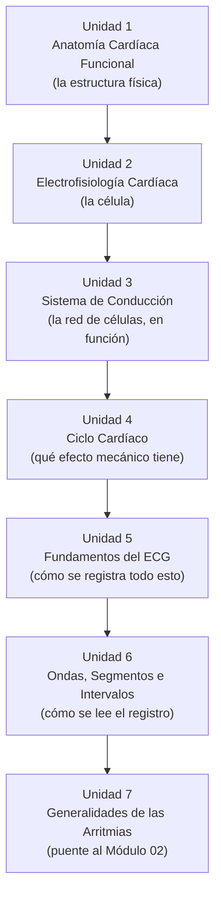
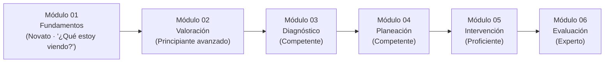

# Arquitectura Pedagógica — Módulo 01: Fundamentos

## Objeto Virtual de Aprendizaje · Manejo Integral de Arritmias Cardíacas

---

## 1. Propósito de este documento

Este documento explica **por qué** el Módulo 01 está diseñado como está: qué modelo pedagógico lo sostiene, cómo se justifica el orden de sus siete unidades, qué nivel cognitivo exige cada objetivo, y cómo se evalúa el aprendizaje. No es una guía de contenido clínico (eso ya vive en `modules/modulo-01.html`) — es el razonamiento instruccional detrás de esa estructura.

Sirve para tres cosas:

1. Justificar el diseño del Módulo 01 ante la Facultad (para el syllabus y la sustentación del proyecto de grado).
2. Servir de plantilla replicable al documentar la arquitectura de los Módulos 02-06.
3. Detectar inconsistencias entre el diseño pretendido y el contenido real ya implementado.

> **Nota de actualización (v3):** este documento pasó por dos rediseños de contenido. El primero (v1→v2) mantuvo la estructura original de 5 unidades pero añadió recursos interactivos propios y cerró las brechas de caso clínico/autoevaluación/bibliografía. El segundo (v2→v3, esta versión) **reemplaza esa estructura de 5 unidades por las 7 unidades del syllabus oficial de la Facultad** (Anatomía cardíaca funcional, Electrofisiología, Sistema de conducción, Ciclo cardíaco, Fundamentos del ECG, Ondas/segmentos/intervalos, Generalidades de las arritmias) — un requisito curricular, no una decisión de diseño libre. Los recursos interactivos construidos en el primer rediseño se conservaron y reubicaron en la unidad que les corresponde bajo la nueva estructura; nada se descartó sin razón.

---

## 2. Fundamentos pedagógicos que rigen el diseño

El Módulo 01 combina tres marcos de referencia, ya presentes implícitamente en el proyecto:

### 2.1 Modelo de adquisición de competencias de Patricia Benner

Según la tabla de progresión cognitiva del proyecto, el Módulo 01 corresponde al nivel **Novato (Novice)**: el estudiante todavía no tiene experiencia previa de la que partir, y necesita reglas explícitas y context-free antes de poder reconocer patrones.

> Pregunta que domina el pensamiento del estudiante en este módulo: **"¿Qué estoy viendo?"**

Esto tiene una consecuencia directa de diseño: el Módulo 01 **no le pide al estudiante decidir nada clínicamente** (eso empieza en el Módulo 04). Su única exigencia es comprender y reconocer.

### 2.2 Taxonomía de Bloom (revisión de Anderson y Krathwohl)

Cada objetivo de aprendizaje del módulo se ancla a un verbo de un nivel cognitivo específico, y ese nivel determina qué tipo de actividad puede evaluarlo. Ver la tabla completa en la sección 4.

### 2.3 Microestructura pedagógica de cinco pasos (definida en el documento maestro de módulos del proyecto)

Cada unidad del OVA debe seguir, en principio, esta secuencia:

1. **Fundamento científico** — qué es y cómo funciona.
2. **Interpretación clínica** — cómo reconocerlo.
3. **Aplicación práctica** — qué implicaciones tiene para el paciente.
4. **Toma de decisiones** — qué hacer o no hacer.
5. **Caso o simulación** — aplicar el conocimiento.

Como se verá en la sección 6, el Módulo 01 **adapta** deliberadamente esta plantilla: al ser nivel Novato, los pasos 4 y 5 (decisión y simulación) se atenúan a favor de los pasos 1-3, porque la toma de decisiones clínicas reales no es competencia de este módulo.

### 2.4 Capa de interacción activa (añadida en el rediseño)

La primera versión del módulo cubría los pasos 1-3 solo con texto explicativo. El rediseño agrega una capa intermedia —ni evaluación sumativa ni decisión clínica— de **interacción activa**: el estudiante manipula el contenido (construye el potencial de acción paso a paso, recorre el sistema de conducción nodo por nodo, empareja ondas del ECG) antes de llegar a la autoevaluación. Pedagógicamente esto corresponde a la fase de "experimentación concreta" del ciclo de Kolb, adelantada dentro del propio Módulo 01 en vez de reservarse solo para los módulos con simulador (03, 05, 06). El detalle de estos recursos está en la sección 6.1.

---

## 3. Competencia general del Módulo 01: la "puerta de entrada"

El Módulo 01 no enseña a manejar arritmias — enseña el lenguaje eléctrico y gráfico sin el cual ningún otro módulo se puede leer. Es la base común sobre la que se apoyan:

- El **Módulo 02** (Valoración), cuando pide reconocer un ABCDE alterado.
- El **Módulo 03** (Diagnóstico), cuando exige leer P-PR-QRS de un trazado real.
- El **Módulo 04** (Planeación), cuando invoca el mecanismo de reentrada o automatismo.

Por diseño, el Módulo 01 no tiene fase asignada en el Proceso de Atención de Enfermería (PAE) — es fisiología y electrofisiología pura, previa a cualquier valoración de un paciente concreto.

---

## 4. Mapa: Objetivo → Nivel de Bloom → Unidad → Evidencia de evaluación

| # | Objetivo de aprendizaje (tal como aparece en el módulo) | Verbo / Nivel de Bloom | Unidad que lo desarrolla | Evidencia de evaluación actual |
|---|---|---|---|---|
| 1 | Describir la anatomía funcional del corazón y la ubicación anatómica del sistema de conducción | **Recordar / Comprender** | Unidad 1 · Anatomía Cardíaca Funcional | Autoevaluación P1 (arteria coronaria del nodo SA/AV); exploración 3D del corazón |
| 2 | Comprender la electrofisiología celular cardíaca: potencial de acción, automatismo, excitabilidad, conductividad y refractariedad | **Comprender** | Unidad 2 · Electrofisiología Cardíaca | Autoevaluación P2 (fase 0); mini reto (fase 2); stepper "Construye el potencial de acción" |
| 3 | Reconocer la jerarquía funcional del sistema de conducción cardíaco | **Recordar / Comprender** | Unidad 3 · Sistema de Conducción | Autoevaluación P3 (frecuencia del nodo AV); diagrama de nodos clicable |
| 4 | Relacionar el ciclo cardíaco con la actividad eléctrica que lo desencadena | **Analizar** | Unidad 4 · Ciclo Cardíaco | Autoevaluación P4 (qué marca el cierre de las válvulas AV); tabla comparativa sístole/diástole |
| 5 | Explicar los fundamentos del registro electrocardiográfico, incluyendo el cálculo de la FC | **Aplicar** | Unidad 5 · Fundamentos del ECG | Autoevaluación P5 (cálculo de FC); mini reto de cálculo; tabs de derivaciones |
| 6 | Identificar las ondas, segmentos e intervalos normales del ECG | **Aplicar** | Unidad 6 · Ondas, Segmentos e Intervalos | Autoevaluación P6 (significado del intervalo QT); Actividad de aprendizaje; reto de emparejar (5 pares) |
| 7 | Reconocer las generalidades de las arritmias cardíacas como puente hacia la valoración clínica | **Comprender / Analizar** (anticipatorio) | Unidad 7 · Generalidades de las Arritmias | Autoevaluación P7 (clasificación brady/taquiarritmia); tabla comparativa de clasificación |

**Lectura del mapa:** a diferencia de la versión anterior (5 objetivos, 2 sin instrumento propio), esta estructura logra una correspondencia 1:1 entre unidad, objetivo y pregunta de autoevaluación desde el primer diseño — no como una brecha corregida después, sino como principio de diseño desde el inicio. Los niveles de Bloom siguen una progresión similar a la versión anterior (Recordar/Comprender en las unidades más descriptivas, subiendo a Aplicar/Analizar en las unidades que exigen cálculo o clasificación).

---

## 5. Justificación de la secuencia de las siete unidades

El orden lo define el syllabus oficial, y resulta pedagógicamente coherente: cada unidad depende conceptualmente de la anterior.

- **U1 → U2:** no se puede explicar el potencial de acción sin saber primero dónde ocurre — la anatomía (cavidades, válvulas, irrigación) es el "mapa" físico sobre el que se apoya la electrofisiología.
- **U2 → U3:** la jerarquía de marcapasos (SA, AV, His-Purkinje) solo se entiende si antes se sabe qué es un potencial de acción y por qué una célula puede "generar" un impulso (automatismo). La Unidad 1 ya mostró *dónde* está anatómicamente cada nodo; la Unidad 3 explica *cómo funcionan juntos*.
- **U3 → U4:** una vez entendida la conducción eléctrica, se muestra su consecuencia mecánica inmediata: la despolarización dispara la contracción (sístole) y la repolarización coincide con la relajación (diástole).
- **U4 → U5:** el ciclo cardíaco (mecánico) y la conducción (eléctrica) son exactamente lo que el ECG registra desde la superficie corporal — por eso el ECG se enseña después de entender qué produce la señal, no antes.
- **U5 → U6:** una vez que el estudiante sabe qué es el papel milimetrado y cómo se calcula la frecuencia, puede aprender a nombrar cada onda, segmento e intervalo del trazado.
- **U6 → U7:** con el ECG normal ya dominado, la unidad de cierre introduce qué es y cómo se clasifica una arritmia — sin pedir todavía ninguna decisión clínica, solo generalidades que preparan el terreno para el Módulo 02.

Esta secuencia sigue un patrón **de lo estructural a lo funcional, y de lo funcional al registro** (anatomía → célula → red de conducción → mecánica → registro → lectura → generalización patológica), coherente con el nivel Novato: cada paso añade una sola capa de abstracción sobre la anterior.

---

## 6. Microestructura pedagógica aplicada, unidad por unidad

Verificación de la plantilla de 5 pasos (sección 2.3) contra el contenido real de cada unidad:

| Paso de la plantilla | U1 Anatomía | U2 Electrofisiología | U3 Sist. Conducción | U4 Ciclo Cardíaco | U5 Fundamentos ECG | U6 Ondas/Segmentos | U7 Generalidades |
|---|---|---|---|---|---|---|---|
| 1. Fundamento científico | ✅ Cavidades, válvulas, irrigación | ✅ Potencial de acción, 4 propiedades | ✅ Jerarquía de nodos | ✅ Sístole/diástole | ✅ Qué registra, derivaciones, papel | ✅ P, PR, QRS, ST, T, QT, U | ✅ Definición y clasificación |
| 2. Interpretación clínica | ✅ Relevancia clínica (IAM y coronarias) | ✅ ídem | ✅ ídem | ✅ ídem | ✅ ídem | ✅ ídem | ✅ ídem |
| 3. Aplicación práctica | ➖ (se traslada a la exploración 3D) | ✅ Aplicación en Enfermería | ➖ | ➖ | ✅ Aplicación en Enfermería | ➖ | ➖ |
| 4. Toma de decisiones | ⚠️ Atenuado | ⚠️ Atenuado | ⚠️ Atenuado | ⚠️ Atenuado | ⚠️ Atenuado | ⚠️ Atenuado | ⚠️ Atenuado (mecanismos, sin decidir tratamiento) |
| 5. Caso o simulación | ➖ Centralizado al final del módulo | ➖ | ➖ | ➖ | ➖ | ➖ | ➖ |
| 2.4 Interacción activa | ✅ Modelo 3D real | ✅ Stepper + mini reto | ✅ Diagrama de nodos | ➖ (tabla comparativa) | ✅ Tabs + mini reto de cálculo | ✅ Reto de emparejar (5 pares) | ➖ (tabla de clasificación) |

**Conclusión:** el patrón de `key-box` + `key-box danger` se mantiene consistente en las 7 unidades. La capa 4 (decisión) sigue atenuada deliberadamente en todas — incluida la nueva Unidad 7, cuyo repaso de "mecanismos" es intencionalmente introductorio (el Módulo 04 es quien exige análisis profundo de mecanismos para decidir tratamiento). La interacción activa ahora cubre 4 de las 7 unidades (1, 2, 3, 5) más las tablas comparativas de las Unidades 4 y 7, que cumplen una función equivalente de síntesis visual sin requerir un widget dedicado.

### 6.1 Recursos interactivos propios del módulo

Los recursos interactivos genéricos y reutilizables (definidos en `css/10-componentes.css` y `js/12-widgets-aprendizaje.js`, no específicos de este módulo) se reubicaron según la unidad a la que pertenecen bajo la nueva estructura de 7 unidades:

- **Modelo 3D real del corazón** (`assets/models/Heart.glb`, Unidad 1 — Anatomía): se trasladó aquí desde su ubicación original (antes en la unidad de "Sistema de Conducción") porque encaja mejor con el contenido puramente anatómico (cavidades, válvulas). Mantiene el caption honesto: es un modelo anatómico general, no marca las vías de conducción.
- **Stepper de fases** (Unidad 2 — Electrofisiología): recorrido secuencial de las 5 fases del potencial de acción, cada una explicando además a cuál de las 4 propiedades eléctricas (automatismo, excitabilidad, conductividad, refractariedad) corresponde.
- **Diagrama de nodos clicable** (Unidad 3 — Sistema de Conducción): jerarquía funcional SA→AV→His→Purkinje (frecuencia intrínseca, rol, qué pasa si falla) — complementa, sin repetir, la vista puramente anatómica ya dada en la Unidad 1.
- **Tabs** (Unidad 5 — Fundamentos del ECG): separa derivaciones bipolares de unipolares.
- **Mini retos** (Unidades 2 y 5): el de la Unidad 2 refuerza la Fase 2 del potencial de acción; el nuevo de la Unidad 5 pone en práctica el cálculo de frecuencia cardíaca con un ejemplo numérico concreto (cuadros grandes entre ondas R).
- **Reto de emparejar** (Unidad 6 — Ondas, Segmentos e Intervalos): se amplió de 4 a 5 pares para incluir el segmento ST y el intervalo QT, que no existían en la versión anterior del módulo. Sigue usando "toca para emparejar" en vez de arrastrar y soltar nativo de HTML5, por accesibilidad táctil y de teclado (`docs/CLAUDE.md`).

Todos los widgets comparten el mismo principio de diseño: la respuesta correcta o el contenido de cada paso vive en el HTML (atributos `data-correcta`, o paneles pre-escritos), y el JavaScript solo la lee — nunca la genera ni la inventa.

---

## 7. Estrategia de evaluación multinivel

El módulo evalúa en tres momentos distintos, con tres propósitos distintos:

| Instrumento | Momento | Propósito pedagógico | Nivel de Bloom que mide |
|---|---|---|---|
| `key-box` / `key-box danger` (dentro de cada unidad) | Formativo, in-line | Refuerzo inmediato del concepto justo donde aparece — sin calificación | Recordar / Comprender |
| Mini reto, stepper, diagrama de nodos, reto de emparejar (sección 6.1) | Formativo, in-line, con retroalimentación real (✅/❌) | Manipulación activa del contenido antes de la evaluación final | Comprender / Aplicar |
| Actividad de aprendizaje (1 pregunta) | Al cierre del desarrollo, antes del resumen | Chequeo rápido de un concepto puntual | Aplicar |
| Caso clínico | Antes de la autoevaluación | Integración de varias unidades en un escenario único, estrictamente de reconocimiento (nunca "qué haría usted") | Aplicar / Analizar |
| Autoevaluación (7 preguntas, una por objetivo) | Cierre del módulo | Verificación sumativa-formativa (intentos ilimitados, retroalimentación real por pregunta vía `verificarAutoevaluacion`) de los 7 objetivos | Recordar / Comprender / Aplicar / Analizar |

Este diseño en capas es coherente con el ciclo de aprendizaje experiencial (Kolb): concepto → interacción activa (sección 6.1) → aplicación integrada (caso) → verificación (autoevaluación) — el Módulo 01 ya incorpora su propia fase de "experimentación concreta" a menor escala, antes de la experimentación con datos clínicos reales que exigirán los módulos con simulador (03, 05, 06).

---

## 8. Historial de brechas y decisiones de rediseño

**Del diseño v1 (5 unidades, contenido incompleto) al v2 (5 unidades, contenido completo):** se cerraron 4 brechas — caso clínico sin redactar, autoevaluación con enunciados de relleno, bibliografía genérica, y los objetivos 4-5 sin instrumento de evaluación propio. Como efecto colateral se encontró y corrigió un bug real presente en los 6 módulos de la OVA: el botón "Enviar respuestas" llamaba a `verificarActividad`, que buscaba un contenedor (`.modulo-actividad`) del que `.modulo-autoevaluacion` no es descendiente sino hermano — producía un `TypeError` en vez de validar nada. Se separó en `verificarActividad` (sin cambios) y una nueva `verificarAutoevaluacion` que sí opera sobre `.modulo-autoevaluacion`.

**Del diseño v2 (5 unidades) al v3 (7 unidades, esta versión):** la Facultad indicó que el Módulo 01 debe seguir la estructura oficial del syllabus, distinta de las 5 unidades del rediseño libre. Esto implicó:

- **Unidades agregadas por completo:** Unidad 1 (Anatomía Cardíaca Funcional) y Unidad 4 (Ciclo Cardíaco) no existían en ninguna versión anterior — contenido nuevo.
- **Unidades eliminadas:** "Hemodinamia Aplicada a Arritmias" y "Rol de Enfermería en Monitorización" (v2, Unidades 4 y 5) no forman parte de la estructura oficial del Módulo 01. No se perdió contenido de valor: ambos temas ya están cubiertos en profundidad por el **Módulo 02 (Valoración)** — la valoración hemodinámica (FC, TA, PAM, perfusión) y la monitorización electrocardiográfica son, de hecho, unidades completas de ese módulo.
- **Unidades expandidas:** la antigua "Fundamentos del ECG" (v2, Unidad 3) se dividió en dos unidades oficiales — Unidad 5 (registro, derivaciones, papel milimetrado, **cálculo de FC**, contenido nuevo) y Unidad 6 (ondas, segmentos e intervalos, ampliada con **segmento ST, intervalo QT y onda U**, que no existían antes).
- **Unidad nueva de cierre:** Unidad 7 (Generalidades de las Arritmias) reemplaza el cierre anterior — introduce definición, clasificación y una mención breve de mecanismos (remitiendo al Módulo 04 para el detalle), en vez de terminar en contenido de monitorización que ya no corresponde a este módulo.
- **Recursos interactivos:** ninguno se descartó. Los cuatro construidos en el rediseño v2 (modelo 3D, stepper, diagrama de nodos, reto de emparejar) se reubicaron en la unidad oficial que les corresponde temáticamente (ver sección 6.1), y se sumaron dos mini retos nuevos.
- **Autoevaluación:** pasó de 5 a 7 preguntas, recuperando desde el inicio la correspondencia 1:1 objetivo↔pregunta que en v2 se había logrado como corrección de una brecha.

---

## 9. Relación con el resto de la OVA

El Módulo 01 no se evalúa a sí mismo como un fin — su éxito real se mide indirectamente en los módulos siguientes: si un estudiante llega al Módulo 03 y no puede identificar un QRS ancho, la falla no está en el Módulo 03, está en que el Módulo 01 no logró consolidar el objetivo 3. Por eso cualquier revisión futura del Módulo 01 debería validarse preguntando: *¿este cambio hace más probable que el estudiante tenga éxito en el Módulo 02 y 03?*
