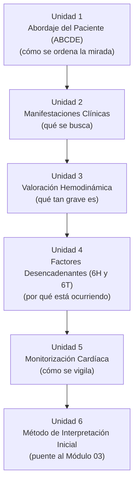

# Arquitectura Pedagógica — Módulo 02: Valoración

## Objeto Virtual de Aprendizaje · Manejo Integral de Arritmias Cardíacas

---

## 1. Propósito de este documento

Explica **por qué** el Módulo 02 está diseñado como está. Sigue la misma plantilla que `ARQUITECTURA-PEDAGOGICA-MODULO-01.md`, del que hereda los fundamentos pedagógicos: niveles de complejidad del aprendizaje (sección 2.1 de aquel documento), taxonomía de Bloom, microestructura de cinco pasos y capa de interacción activa. Aquí solo se documenta lo específico de este módulo.

El contenido clínico vive en `modules/modulo-02.html`.

---

## 2. Nivel de complejidad y competencia general

| | |
|---|---|
| **Nivel de complejidad del aprendizaje** | **Comprender** |
| **Fase del Proceso de Atención de Enfermería** | Valoración |
| **Pregunta que domina el pensamiento del estudiante** | **¿Cómo está el paciente?** |

El Módulo 01 dejó al estudiante capaz de reconocer estructuras y un trazado normal. El Módulo 02 le exige comprender qué significan los hallazgos **en un paciente concreto**: qué le ocurre, qué tan grave es y qué lo está provocando.

**Competencia:** valorar de forma sistemática al paciente con sospecha de arritmia, integrando el abordaje ABCDE, las manifestaciones clínicas, el estado hemodinámico y los factores desencadenantes reversibles, y aplicar un método ordenado de interpretación inicial que permita distinguir una arritmia estable de una inestable.

**Frontera deliberada:** este módulo **no diagnostica ningún ritmo por su nombre**. Reconocer «esto es una fibrilación auricular» pertenece al Módulo 03. Aquí se establece el estado del paciente y el método de lectura, no la etiqueta diagnóstica. Cruzar esa frontera vaciaría de contenido al módulo siguiente.

---

## 3. Mapa: Objetivo → Nivel de Bloom → Unidad → Evidencia de evaluación

| # | Objetivo de aprendizaje | Verbo / Nivel de Bloom | Unidad | Evidencia de evaluación |
|---|---|---|---|---|
| 1 | Aplicar un abordaje sistemático (ABCDE) al paciente con sospecha de arritmia | **Aplicar** | Unidad 1 · Abordaje del Paciente | Stepper del recorrido ABCDE; pregunta de autoevaluación |
| 2 | Reconocer las manifestaciones clínicas asociadas a las arritmias cardíacas | **Recordar / Comprender** | Unidad 2 · Manifestaciones Clínicas | Acordeón por sistema afectado; pregunta de autoevaluación |
| 3 | Valorar el estado hemodinámico mediante frecuencia cardíaca, tensión arterial, presión arterial media y signos de perfusión | **Analizar** | Unidad 3 · Valoración Hemodinámica | Mini reto de cálculo de PAM; pregunta de autoevaluación |
| 4 | Identificar los factores desencadenantes reversibles de una arritmia (6H y 6T) | **Recordar / Comprender** | Unidad 4 · Factores Desencadenantes | Reto de emparejar causa↔intervención; pregunta de autoevaluación |
| 5 | Aplicar los principios de la monitorización electrocardiográfica continua y del ECG de 12 derivaciones | **Aplicar** | Unidad 5 · Monitorización Cardíaca | Mini reto de colocación de electrodos; pregunta de autoevaluación |
| 6 | Aplicar un método sistemático de interpretación inicial del ritmo cardíaco | **Aplicar** | Unidad 6 · Método de Interpretación Inicial | Stepper del método de 5 preguntas |

### 🔴 Brecha detectada: falta una pregunta de autoevaluación

El módulo declara **6 objetivos** y la autoevaluación implementada tiene **5 preguntas**. Un objetivo queda sin verificación sumativa.

Esto rompe el principio de correspondencia 1:1 que el Módulo 01 sostiene como criterio de calidad. Por la naturaleza del contenido, el candidato más probable a quedar sin instrumento propio es el **objetivo 6** (método de interpretación), que además es el más importante del módulo: es el que habilita el Módulo 03 completo.

**Acción recomendada:** añadir una sexta pregunta sobre el método de interpretación inicial, con un trazado sencillo donde el estudiante deba aplicar la secuencia sin llegar a nombrar el ritmo.

---

## 4. Justificación de la secuencia de las seis unidades

La secuencia va **del paciente al trazado**, no al revés. Es la decisión pedagógica central del módulo y merece hacerse explícita en el contenido, porque corrige el error más frecuente del estudiante novel: mirar el monitor antes que al paciente.

- **U1 → U2:** el ABCDE ordena la mirada; las manifestaciones clínicas le dan contenido a esa mirada. Sin el orden primero, los síntomas se recogen de forma dispersa.
- **U2 → U3:** los síntomas orientan, pero solo las cifras definen la gravedad. Aquí aparece por primera vez el criterio **estable / inestable**, que gobernará todo el resto del curso.
- **U3 → U4:** establecida la gravedad, hay que buscar la causa reversible **antes** de tratar el ritmo. El orden importa clínicamente: tratar la arritmia sin corregir la hipoxia o la hipovolemia que la produce es un error de razonamiento, no solo de técnica.
- **U4 → U5:** la monitorización es la herramienta que permite vigilar de forma continua todo lo anterior.
- **U5 → U6:** con el paciente ya valorado y monitorizado, se introduce el método ordenado de lectura del trazado — la puerta al Módulo 03.

**Nota sobre la Unidad 4:** las 6H y 6T se enseñan aquí, en valoración, y no en el Módulo 05 junto con la reanimación. Es deliberado: son parte de la valoración de la causa, no del tratamiento. El Módulo 05 las invocará como conocimiento previo.

---

## 5. Microestructura pedagógica aplicada

| Paso de la plantilla | U1 ABCDE | U2 Manifestaciones | U3 Hemodinámica | U4 6H/6T | U5 Monitorización | U6 Método |
|---|---|---|---|---|---|---|
| 1. Fundamento científico | ✅ | ✅ | ✅ | ✅ | ✅ | ✅ |
| 2. Interpretación clínica | ✅ | ✅ | ✅ | ✅ | ✅ | ✅ |
| 3. Aplicación práctica | ✅ | ➖ | ✅ | ✅ | ✅ | ✅ |
| 4. Toma de decisiones | ⚠️ Incipiente (estable/inestable) | ➖ | ⚠️ Incipiente | ⚠️ Incipiente | ➖ | ➖ |
| 5. Caso o simulación | ➖ Centralizado al final del módulo | ➖ | ➖ | ➖ | ➖ | ➖ |
| Interacción activa | ✅ Stepper | ✅ Acordeón | ✅ Mini reto | ✅ Emparejar | ✅ Mini reto | ✅ Stepper |

**Diferencia respecto al Módulo 01:** aquí el paso 4 (toma de decisiones) deja de estar completamente atenuado y aparece de forma **incipiente**. El estudiante todavía no elige un tratamiento, pero sí emite un juicio con consecuencias: «este paciente está inestable». Ese juicio es el primer acto decisorio del curso y el que justifica que el módulo esté en el nivel «comprender» y no en «reconocer».

### 5.1 Recursos interactivos del módulo

Inventario real implementado en `modules/modulo-02.html`:

- **Steppers** (11 pasos en total): el recorrido ABCDE y el método de interpretación inicial. Son los dos procedimientos secuenciales del módulo, y el stepper es el widget que mejor representa un algoritmo de pasos ordenados.
- **Reto de emparejar** (6 pares): causas reversibles con su intervención correspondiente. Formato adecuado porque las 6H y 6T son, por naturaleza, un ejercicio de asociación.
- **Mini retos** (2): cálculo de presión arterial media e identificación de colocación de electrodos.
- **Acordeón** (2 bloques): manifestaciones clínicas agrupadas por sistema, para no presentar una lista plana larga.

Todos siguen el principio del proyecto: la respuesta correcta vive en el HTML (`data-correcta`) y el JavaScript solo la lee.

---

## 6. Estrategia de evaluación

| Instrumento | Momento | Propósito | Nivel de Bloom |
|---|---|---|---|
| `key-box` / `key-box danger` (5 y 2) | Formativo, in-line | Refuerzo del concepto donde aparece | Recordar / Comprender |
| Steppers, emparejar, mini retos, acordeón | Formativo, con retroalimentación real | Manipulación activa antes de evaluar | Comprender / Aplicar |
| Actividad de aprendizaje | Cierre del desarrollo | Chequeo puntual | Aplicar |
| Caso clínico | Antes de la autoevaluación | Integración de unidades en un paciente único | Aplicar / Analizar |
| Autoevaluación (**5** preguntas) | Cierre del módulo | Verificación sumativa-formativa | Comprender → Analizar |

El caso clínico de este módulo tiene una característica propia: debe terminar **sin nombrar el ritmo**. Su desenlace correcto es una valoración («paciente inestable con signos de bajo gasto y un desencadenante hipóxico identificado»), no un diagnóstico electrocardiográfico.

---

## 7. Brechas y acciones pendientes

| # | Brecha | Severidad | Acción |
|---|---|---|---|
| 1 | 6 objetivos, 5 preguntas de autoevaluación | 🔴 Alta | Añadir la pregunta del método de interpretación (sección 3) |
| 2 | El paso 5 (caso/simulación) no existe por unidad, solo centralizado | 🟡 Media | Aceptable: coherente con el Módulo 01. Revisar si al menos la Unidad 3 merece un micro-caso propio |
| 3 | La Unidad 2 no tiene aplicación práctica declarada | 🟡 Media | Evaluar si el acordeón basta o hace falta un ejercicio de reconocimiento de síntomas |

---

## 8. Relación con el resto de la OVA

**Recibe del Módulo 01:** el lenguaje del ECG (ondas, segmentos, intervalos) y la fisiología que lo produce. Sin ese vocabulario, la Unidad 6 no es enseñable.

**Entrega al Módulo 03:** un estudiante capaz de valorar al paciente y de aplicar un método ordenado de lectura del trazado. El Módulo 03 puede entonces concentrarse exclusivamente en el reconocimiento de patrones, sin volver a explicar cómo se mide un intervalo ni cómo se valora la perfusión.

**Criterio de validación:** si un estudiante llega al Módulo 04 y no distingue un paciente estable de uno inestable, la falla no está en el Módulo 04 — está en que el objetivo 3 de este módulo no se consolidó.
