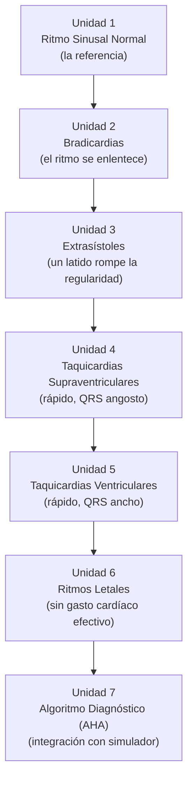

# Arquitectura Pedagógica — Módulo 03: Diagnóstico

## Objeto Virtual de Aprendizaje · Manejo Integral de Arritmias Cardíacas

---

## 1. Propósito de este documento

Explica **por qué** el Módulo 03 está diseñado como está. Hereda los fundamentos pedagógicos de `ARQUITECTURA-PEDAGOGICA-MODULO-01.md` (niveles de complejidad, Bloom, microestructura de cinco pasos, capa de interacción activa). Aquí solo lo específico de este módulo.

El contenido clínico vive en `modules/modulo-03.html`.

---

## 2. Nivel de complejidad y competencia general

| | |
|---|---|
| **Nivel de complejidad del aprendizaje** | **Interpretar** |
| **Fase del Proceso de Atención de Enfermería** | Diagnóstico |
| **Pregunta que domina el pensamiento del estudiante** | **¿Qué ritmo es?** |

Es el primer módulo donde se exige una **respuesta unívoca**. En el Módulo 02 la respuesta correcta era un juicio matizado sobre el estado del paciente; aquí el ritmo tiene un nombre y hay criterios electrocardiográficos objetivos que lo determinan. Esa exigencia de precisión es lo que define el nivel «interpretar».

**Competencia:** identificar y diferenciar los principales ritmos cardíacos —sinusal normal, bradiarritmias, latidos ectópicos, taquiarritmias supraventriculares y ventriculares, y ritmos de paro— aplicando criterios electrocardiográficos objetivos y un algoritmo diagnóstico sistemático apoyado en simulación interactiva.

**Frontera deliberada:** este módulo **nombra** el ritmo; no decide qué hacer con él. Se puede mencionar que un ritmo es letal o desfibrilable —porque forma parte de reconocerlo—, pero la conducta terapéutica pertenece a los Módulos 04 y 05.

---

## 3. Mapa: Objetivo → Nivel de Bloom → Unidad → Evidencia de evaluación

| # | Objetivo de aprendizaje | Verbo / Nivel de Bloom | Unidad | Evidencia de evaluación |
|---|---|---|---|---|
| 1 | Reconocer el ritmo sinusal normal como punto de referencia | **Recordar / Comprender** | Unidad 1 · Ritmo Sinusal Normal | Simulador ECG con ritmo sinusal; pregunta de autoevaluación |
| 2 | Diferenciar los tipos de bradicardias: sinusal y bloqueos auriculoventriculares | **Analizar** | Unidad 2 · Bradicardias | Simulador (bradicardia sinusal, BAV 1.º, Mobitz I y II, BAV completo); reto de emparejar |
| 3 | Identificar extrasístoles auriculares y ventriculares | **Analizar** | Unidad 3 · Extrasístoles | Simulador (EAP, EV); mini reto de ancho del QRS |
| 4 | Diagnosticar taquicardias supraventriculares: sinusal, fibrilación auricular y flutter | **Analizar / Evaluar** | Unidad 4 · Taquicardias Supraventriculares | Simulador (taquicardia sinusal, FA, flutter); reto de emparejar |
| 5 | Diagnosticar taquicardias ventriculares: monomórfica, polimórfica y torsades | **Analizar / Evaluar** | Unidad 5 · Taquicardias Ventriculares | Simulador (TV mono, TV poli, torsades) |
| 6 | Reconocer los ritmos letales de paro cardíaco y su clasificación según la AHA | **Analizar** | Unidad 6 · Ritmos Letales | Simulador (FV, asistolia, AESP) |
| 7 | Aplicar el algoritmo diagnóstico completo usando el simulador ECG | **Aplicar / Evaluar** | Unidad 7 · Algoritmo Diagnóstico (AHA) | Stepper del algoritmo; simulador completo |

### 🔴 Brecha detectada: falta una pregunta de autoevaluación

El módulo declara **7 objetivos** y la autoevaluación implementada tiene **6 preguntas**. Un objetivo queda sin verificación sumativa.

**Acción recomendada:** añadir una séptima pregunta sobre el objetivo 7 (aplicación del algoritmo completo), que es el objetivo integrador del módulo y el que justifica su existencia como unidad separada.

---

## 4. Justificación de la secuencia de las siete unidades

La secuencia va **de la norma a la desviación, y de lo benigno a lo letal**:

- **U1 establece la referencia.** Sin dominar el ritmo sinusal normal, ninguna desviación es reconocible. Todo el módulo se mide contra esta unidad, y por eso ocupa el primer lugar aunque no sea una arritmia.
- **U1 → U2:** la primera desviación es la más simple de leer — el ritmo se enlentece o se bloquea. Introduce el análisis del intervalo PR, que es la clave diagnóstica de los bloqueos AV.
- **U2 → U3:** el latido aislado que rompe la regularidad. Es el puente entre «ritmo lento» y «ritmo rápido», y la primera vez que el estudiante debe distinguir origen auricular de ventricular **por el ancho del QRS**.
- **U3 → U4:** la frecuencia se acelera con QRS angosto (origen supraventricular).
- **U4 → U5:** la frecuencia se acelera con QRS ancho (origen ventricular). **El contraste angosto/ancho entre U4 y U5 es el eje diagnóstico más importante del módulo**, y la razón de que estas dos unidades sean consecutivas y no estén separadas por otro contenido.
- **U5 → U6:** el extremo del espectro — ritmos sin gasto cardíaco efectivo.
- **U6 → U7:** con todos los ritmos ya conocidos por separado, el algoritmo los integra en una secuencia de decisión diagnóstica y el simulador la pone a prueba.

---

## 5. El simulador como columna vertebral del módulo

Este es el módulo donde la capa de interacción activa (sección 2.4 del documento del Módulo 01) deja de ser complemento y pasa a ser el instrumento principal. La razón es simple: **el diagnóstico de ritmos se aprende viendo trazados**, no leyendo descripciones de trazados.

El simulador del proyecto (`js/02-motor-ecg.js`, `js/04-simulador.js`) tiene una característica que lo hace apto para uso pedagógico y no solo demostrativo: **cada arritmia tiene su propio modelo matemático independiente**, de modo que los hallazgos que el estudiante debe reconocer están genuinamente presentes en la señal, no dibujados como una imagen fija.

Consecuencias pedagógicas concretas:

- El **intervalo PR se mide de verdad** sobre el trazado. En el bloqueo AV de primer grado el PR es de 280 ms y no cambia con la frecuencia; en Wenckebach se alarga latido a latido (178 → 279 → 319 ms) antes de la pausa. El estudiante puede observar el fenómeno progresivo, que es imposible de transmitir con una imagen estática.
- El **ancho del QRS distingue** de forma observable el Mobitz II (QRS ancho, infranodal) del Wenckebach (QRS angosto, nodal) — el criterio que la Unidad 2 exige diferenciar.
- El **ancho del canvas determina cuánto tiempo se ve.** Está dimensionado para mostrar unos 8,7 segundos de trazado, suficiente para que un ciclo completo de Wenckebach o una pausa compensatoria quepan en pantalla. Es un requisito pedagógico, no estético.

**Decisión de diseño relevante:** el ritmo sinusal del simulador es perfectamente regular y sin latidos ectópicos. Podría parecer menos realista, pero es deliberado: la Unidad 1 es la referencia contra la cual el estudiante compara todo lo demás, y una referencia con extrasístoles intercaladas al azar impide aprender la desviación. Las extrasístoles viven en la Unidad 3, donde son el objeto de estudio.

---

## 6. Microestructura pedagógica aplicada

| Paso de la plantilla | U1 Sinusal | U2 Bradi | U3 Extrasístoles | U4 TSV | U5 TV | U6 Letales | U7 Algoritmo |
|---|---|---|---|---|---|---|---|
| 1. Fundamento científico | ✅ | ✅ | ✅ | ✅ | ✅ | ✅ | ✅ |
| 2. Interpretación clínica | ✅ | ✅ | ✅ | ✅ | ✅ | ✅ | ✅ |
| 3. Aplicación práctica | ✅ | ✅ | ✅ | ✅ | ✅ | ✅ | ✅ |
| 4. Toma de decisiones | ⚠️ Atenuado deliberadamente | ⚠️ | ⚠️ | ⚠️ | ⚠️ | ⚠️ Se menciona desfibrilable/no desfibrilable | ⚠️ Decisión **diagnóstica**, no terapéutica |
| 5. Caso o simulación | ✅ Simulador | ✅ | ✅ | ✅ | ✅ | ✅ | ✅ |
| Interacción activa | ✅ | ✅ Emparejar | ✅ Mini reto | ✅ Emparejar | ✅ | ✅ | ✅ Stepper |

**Diferencia respecto a los módulos anteriores:** el paso 5 (caso o simulación) está presente en **todas** las unidades, no centralizado al final. Es el único módulo del OVA donde esto ocurre, y se justifica por lo dicho en la sección 5.

El paso 4 sigue atenuado, pero con un matiz: en la Unidad 7 sí hay toma de decisiones, solo que es **decisión diagnóstica** (¿qué criterio aplico ahora para descartar esta familia de ritmos?), no terapéutica.

### 6.1 Recursos interactivos del módulo

Inventario real implementado en `modules/modulo-03.html`:

- **Simulador ECG**, presente a lo largo de todo el módulo con los 17 ritmos del catálogo.
- **Steppers** (9 pasos): el algoritmo diagnóstico de la Unidad 7 y las secuencias de criterios.
- **Retos de emparejar** (6 pares): asociación ritmo↔criterio distintivo.
- **Mini retos** (2): ancho del QRS y regularidad.

---

## 7. Estrategia de evaluación

| Instrumento | Momento | Propósito | Nivel de Bloom |
|---|---|---|---|
| `key-box` / `key-box danger` (5 y 3) | Formativo, in-line | Refuerzo del criterio donde aparece | Comprender |
| Simulador | Continuo | Observación del hallazgo en señal real | Analizar |
| Steppers, emparejar, mini retos | Formativo, con retroalimentación | Aplicación del criterio | Aplicar / Analizar |
| Actividad de aprendizaje | Cierre del desarrollo | Chequeo puntual | Aplicar |
| Caso clínico | Antes de la autoevaluación | Integración diagnóstica | Analizar / Evaluar |
| Autoevaluación (**6** preguntas) | Cierre del módulo | Verificación sumativa-formativa | Analizar / Evaluar |

---

## 8. Brechas y acciones pendientes

| # | Brecha | Severidad | Acción |
|---|---|---|---|
| 1 | 7 objetivos, 6 preguntas de autoevaluación | 🔴 Alta | Añadir la pregunta del objetivo 7 (algoritmo integrador) |
| 2 | El syllabus describe un bloque de ECG diagnóstico —crecimiento de cavidades (P pulmonale y mitrale, Sokolow-Lyon), alteraciones isquémicas y de repolarización, bloqueos de rama y hemibloqueos, alteraciones por desequilibrio electrolítico— que **no aparece en ninguna de las siete unidades** | 🔴 Alta | Confirmar con la asesora si entra en el alcance del OVA. Es la brecha curricular más visible del proyecto frente al syllabus aprobado |
| 3 | La taxonomía NANDA/NOC/NIC no aparece en este módulo | 🟡 Media | Probablemente correcto: el syllabus la exige en planeación y evaluación. Confirmar que no se espera un diagnóstico enfermero aquí |

---

## 9. Relación con el resto de la OVA

**Recibe del Módulo 01** el vocabulario del ECG y **del Módulo 02** el método ordenado de lectura del ritmo. La Unidad 6 del Módulo 02 y la Unidad 1 de este módulo son consecutivas por diseño: una enseña *cómo mirar*, la otra *qué se ve cuando todo está normal*.

**Entrega al Módulo 04** un estudiante capaz de nombrar el ritmo. Solo entonces tiene sentido preguntar qué hacer con él: no se puede priorizar una conducta sobre un ritmo que no se sabe identificar.

**Criterio de validación:** si un estudiante llega al Módulo 05 y aplica cardioversión sincronizada a una taquicardia ventricular polimórfica, la falla probablemente no está en el Módulo 05 — está en que el objetivo 5 de este módulo no consolidó la diferencia entre TV monomórfica y polimórfica.
