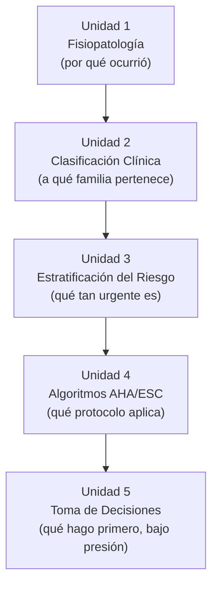

# Arquitectura Pedagógica — Módulo 04: Planeación

## Objeto Virtual de Aprendizaje · Manejo Integral de Arritmias Cardíacas

---

## 1. Propósito de este documento

Explica **por qué** el Módulo 04 está diseñado como está. Hereda los fundamentos pedagógicos de `ARQUITECTURA-PEDAGOGICA-MODULO-01.md`. Aquí solo lo específico de este módulo.

El contenido clínico vive en `modules/modulo-04.html`.

---

## 2. Nivel de complejidad y competencia general

| | |
|---|---|
| **Nivel de complejidad del aprendizaje** | **Priorizar** |
| **Fase del Proceso de Atención de Enfermería** | Planeación |
| **Pregunta que domina el pensamiento del estudiante** | **¿Qué hago primero?** |

### 2.1 El salto cualitativo del curso

Este módulo marca la ruptura más importante de la OVA. Hasta aquí, **toda respuesta correcta era verificable contra un criterio objetivo**: una estructura tiene un nombre, un intervalo mide 160 ms, un ritmo con QRS ancho y frecuencia de 160 es una taquicardia ventricular monomórfica.

A partir del Módulo 04 eso deja de ser cierto. La respuesta correcta depende del contexto, del tiempo disponible y del estado del paciente. Dos conductas pueden ser ambas defendibles y una tercera ser francamente errónea, sin que exista un criterio numérico que lo dirima.

Esto tiene una consecuencia de diseño que conviene explicitar: **el contenido debe reflejar esa incertidumbre en vez de esconderla**. Un módulo de planeación redactado como lista de recetas enseña exactamente lo contrario de lo que pretende. La incertidumbre acotada por algoritmos —no su ausencia— es el objeto de aprendizaje.

**Competencia:** explicar el mecanismo fisiopatológico que origina una arritmia diagnosticada, clasificarla clínicamente, estratificar el riesgo del paciente según su estabilidad hemodinámica, seleccionar el algoritmo AHA/ESC correspondiente y priorizar la secuencia de actuación en escenarios de tiempo crítico, formulando el plan de cuidados con taxonomía NANDA/NOC/NIC.

**Frontera deliberada:** este módulo decide **qué** hacer y **en qué orden**. La técnica de la cardioversión, las dosis exactas y el manejo del desfibrilador pertenecen al Módulo 05.

---

## 3. Mapa: Objetivo → Nivel de Bloom → Unidad → Evidencia de evaluación

| # | Objetivo de aprendizaje | Verbo / Nivel de Bloom | Unidad | Evidencia de evaluación |
|---|---|---|---|---|
| 1 | Explicar los mecanismos fisiopatológicos que originan una arritmia | **Comprender / Analizar** | Unidad 1 · Fisiopatología | Stepper de mecanismos; reto de emparejar mecanismo↔arritmia |
| 2 | Clasificar clínicamente una arritmia ya diagnosticada según su origen y frecuencia | **Analizar** | Unidad 2 · Clasificación Clínica | Reto de emparejar; pregunta de autoevaluación |
| 3 | Estratificar el riesgo del paciente según su estabilidad hemodinámica y signos de alarma | **Evaluar** | Unidad 3 · Estratificación del Riesgo | Mini reto estable/inestable; pregunta de autoevaluación |
| 4 | Relacionar cada familia de arritmias con su algoritmo AHA/ESC correspondiente | **Aplicar** | Unidad 4 · Algoritmos AHA/ESC | Stepper del algoritmo; pregunta de autoevaluación |
| 5 | Priorizar el siguiente paso clínico en escenarios de tiempo crítico | **Evaluar / Crear** | Unidad 5 · Toma de Decisiones | Escenarios de priorización; pregunta de autoevaluación |

### 🔴 Brecha detectada: falta una pregunta de autoevaluación

El módulo declara **5 objetivos** y la autoevaluación implementada tiene **4 preguntas**. Por el orden del contenido, el objetivo sin instrumento propio es probablemente el **1** (fisiopatología), que es además el único de naturaleza explicativa y no decisoria — el más fácil de omitir al construir una evaluación centrada en escenarios.

**Acción recomendada:** añadir una pregunta sobre mecanismos (reentrada, automatismo anormal, actividad desencadenada). No es un objetivo accesorio: es el que permite entender *por qué* un tratamiento funciona, y sin él la Unidad 4 se memoriza en vez de comprenderse.

---

## 4. Justificación de la secuencia de las cinco unidades

La secuencia va **del mecanismo a la decisión**:

- **U1** explica *por qué* se produjo la arritmia. El Módulo 01 mencionó los mecanismos de pasada, como generalidades; aquí se desarrollan (automatismo anormal, actividad desencadenada, reentrada) porque son los que justifican por qué un tratamiento funciona y otro no. Sin esta unidad, los algoritmos de la Unidad 4 son listas que se memorizan.
- **U1 → U2:** con el mecanismo claro, la arritmia se agrupa en familias que comparten conducta. La clasificación no es taxonómica por sí misma: agrupa lo que se trata igual.
- **U2 → U3:** la familia orienta, pero la conducta la define la estabilidad hemodinámica del paciente concreto. **Esta unidad es el corazón del módulo**: la bifurcación estable/inestable es de la que cuelga todo lo demás, en este módulo y en el siguiente.
- **U3 → U4:** cada combinación de familia y estabilidad remite a un algoritmo publicado.
- **U4 → U5:** los algoritmos se aplican bajo presión de tiempo, que es donde el conocimiento se pone realmente a prueba.

**Nota sobre la Unidad 3:** el criterio estable/inestable ya apareció, de forma incipiente, en la Unidad 3 del Módulo 02 (valoración hemodinámica). Aquí no se repite: se convierte en criterio **decisorio**. La diferencia entre los dos módulos en este punto es exactamente la diferencia entre comprender y priorizar.

---

## 5. Taxonomía NANDA / NOC / NIC

El syllabus de la Facultad **exige** que el razonamiento de planeación se exprese con la taxonomía enfermera estandarizada. Este es, junto con el Módulo 06, el lugar donde esa exigencia se materializa.

| Componente | Qué debe aparecer |
|---|---|
| **NANDA** | Diagnósticos pertinentes a las familias de arritmias: disminución del gasto cardíaco, riesgo de perfusión tisular cardíaca ineficaz, intolerancia a la actividad, ansiedad |
| **NOC** | Resultados esperados con sus indicadores medibles |
| **NIC** | Intervenciones con código. El syllabus menciona expresamente: Monitorización electrocardiográfica (**4160**), Manejo de arritmias (**4030**), Cuidados cardíacos agudos (**4040**) |

**Esta es la parte del OVA con especificidad propia de enfermería.** El resto del recurso está dirigido a estudiantes de ciencias de la salud en general; aquí el contenido es deliberadamente disciplinar y no debe generalizarse.

> ⚠️ **Estado por verificar:** no se ha confirmado que `modules/modulo-04.html` implemente actualmente esta taxonomía. Es un requisito curricular explícito y su ausencia sería una brecha de cumplimiento frente al syllabus aprobado, no una omisión menor de contenido.

---

## 6. Microestructura pedagógica aplicada

| Paso de la plantilla | U1 Fisiopatología | U2 Clasificación | U3 Riesgo | U4 Algoritmos | U5 Decisiones |
|---|---|---|---|---|---|
| 1. Fundamento científico | ✅ | ✅ | ✅ | ✅ | ➖ |
| 2. Interpretación clínica | ✅ | ✅ | ✅ | ✅ | ✅ |
| 3. Aplicación práctica | ✅ | ✅ | ✅ | ✅ | ✅ |
| 4. Toma de decisiones | ⚠️ Anticipatorio | ✅ **Plena** | ✅ **Plena** | ✅ **Plena** | ✅ **Plena** |
| 5. Caso o simulación | ➖ | ➖ | ✅ | ✅ | ✅ |
| Interacción activa | ✅ Stepper | ✅ Emparejar | ✅ Mini reto | ✅ Stepper | ✅ Escenarios |

**Diferencia respecto a los módulos anteriores:** el paso 4 (toma de decisiones) deja de estar atenuado y pasa a ser **el eje del módulo**. Es la primera vez en toda la OVA que ocurre. Los Módulos 01 a 03 lo mantenían deliberadamente suspendido; aquí se activa por completo.

### 6.1 Recursos interactivos del módulo

Inventario real implementado en `modules/modulo-04.html`:

- **Steppers** (4 pasos): mecanismos fisiopatológicos y recorrido del algoritmo.
- **Retos de emparejar** (3 pares): mecanismo↔arritmia, familia↔algoritmo.
- **Mini retos** (2): estratificación estable/inestable.

**Observación:** es el módulo con **menos densidad interactiva** de los cinco primeros (3 pares de emparejar frente a 6 y 7 en los módulos 02 y 05). Dado que es el módulo donde se aprende a decidir, y que decidir se aprende decidiendo, es una debilidad de diseño y no solo un dato de inventario. Ver sección 8.

---

## 7. Estrategia de evaluación

| Instrumento | Momento | Propósito | Nivel de Bloom |
|---|---|---|---|
| `key-box` / `key-box danger` (3 y 1) | Formativo, in-line | Refuerzo del criterio | Comprender |
| Steppers, emparejar, mini retos | Formativo, con retroalimentación | Aplicación del criterio | Aplicar / Analizar |
| Actividad de aprendizaje | Cierre del desarrollo | Chequeo puntual | Aplicar |
| Caso clínico | Antes de la autoevaluación | Priorización integrada | Evaluar |
| Autoevaluación (**4** preguntas) | Cierre del módulo | Verificación sumativa-formativa | Analizar / Evaluar |

**Particularidad:** este es el primer módulo donde una pregunta de autoevaluación puede legítimamente tener más de una respuesta defendible. El instrumento debe reflejarlo — bien acotando el escenario lo suficiente para que exista una única mejor conducta, bien explicando en la retroalimentación por qué una opción es *mejor* y no simplemente *correcta*.

---

## 8. Brechas y acciones pendientes

| # | Brecha | Severidad | Acción |
|---|---|---|---|
| 1 | 5 objetivos, 4 preguntas de autoevaluación | 🔴 Alta | Añadir la pregunta de fisiopatología (sección 3) |
| 2 | Taxonomía NANDA/NOC/NIC exigida por el syllabus, implementación sin verificar | 🔴 Alta | Auditar `modules/modulo-04.html` y añadirla si falta |
| 3 | Densidad interactiva baja para un módulo de toma de decisiones | 🟡 Media | Considerar un árbol de decisión navegable o un escenario cronometrado en la Unidad 5 |
| 4 | Las unidades 1 y 2 no tienen paso 5 (caso o simulación) | 🟢 Baja | Aceptable: son las unidades explicativas del módulo |

---

## 9. Relación con el resto de la OVA

**Recibe del Módulo 03** un ritmo ya identificado por su nombre. Toda la lógica de este módulo presupone esa identificación: no se puede estratificar el riesgo de un ritmo que no se sabe cuál es.

**Recibe del Módulo 02** el criterio estable/inestable en su forma valorativa, y lo convierte en criterio decisorio.

**Entrega al Módulo 05** una conducta decidida y priorizada, lista para ejecutarse. La separación entre decidir y ejecutar es lo que permite que el Módulo 05 se concentre en la técnica sin volver a justificar la indicación.

**Criterio de validación:** si un estudiante llega al Módulo 06 y ante un caso completo elige la intervención correcta pero en el momento equivocado —desfibrilar antes de comprobar el ritmo, o administrar un fármaco antes de corregir la causa reversible—, la falla está en el objetivo 5 de este módulo.
