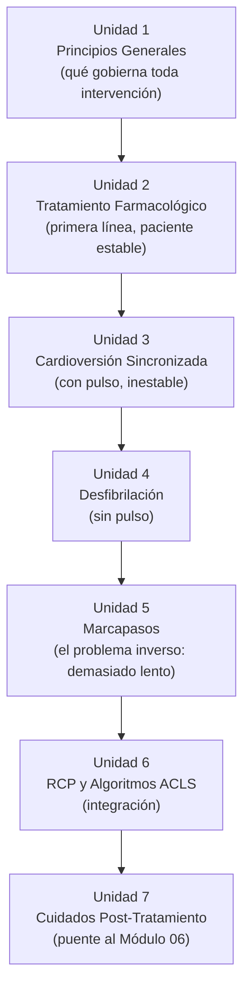

# Arquitectura Pedagógica — Módulo 05: Intervención

## Objeto Virtual de Aprendizaje · Manejo Integral de Arritmias Cardíacas

---

## 1. Propósito de este documento

Explica **por qué** el Módulo 05 está diseñado como está. Hereda los fundamentos pedagógicos de `ARQUITECTURA-PEDAGOGICA-MODULO-01.md`. Aquí solo lo específico de este módulo.

El contenido clínico vive en `modules/modulo-05.html`.

---

## 2. Nivel de complejidad y competencia general

| | |
|---|---|
| **Nivel de complejidad del aprendizaje** | **Aplicar** |
| **Fase del Proceso de Atención de Enfermería** | Ejecución |
| **Pregunta que domina el pensamiento del estudiante** | **¿Cómo lo hago?** |

El Módulo 04 dejó una conducta decidida. Este módulo la ejecuta. El contenido es **operativo**: pasos, verificaciones previas, criterios de seguridad y errores frecuentes con consecuencias reales.

**Competencia:** seleccionar y aplicar la intervención terapéutica adecuada a cada tipo de arritmia —farmacológica, eléctrica o de estimulación—, ejecutar la RCP de alta calidad integrada en los algoritmos ACLS, y planificar los cuidados de enfermería posteriores a la intervención.

**Frontera deliberada:** este módulo ejecuta. La lectura del resultado, las complicaciones tardías y el seguimiento pertenecen al Módulo 06.

---

## 3. Mapa: Objetivo → Nivel de Bloom → Unidad → Evidencia de evaluación

| # | Objetivo de aprendizaje | Verbo / Nivel de Bloom | Unidad | Evidencia de evaluación |
|---|---|---|---|---|
| 1 | Reconocer los principios generales, indicaciones y contraindicaciones del tratamiento de arritmias | **Comprender** | Unidad 1 · Principios Generales | Reto de emparejar indicación↔contraindicación |
| 2 | Comprender el mecanismo y uso clínico de los principales grupos de antiarrítmicos | **Comprender / Aplicar** | Unidad 2 · Tratamiento Farmacológico | Reto de emparejar fármaco↔mecanismo; simulador de intervenciones |
| 3 | Diferenciar cardioversión sincronizada de desfibrilación, y saber cuándo usar cada una | **Analizar / Evaluar** | Unidad 3 · Cardioversión + Unidad 4 · Desfibrilación | Simulador; mini reto sincronizada/no sincronizada |
| 4 | Reconocer los tipos de marcapasos y sus indicaciones | **Comprender** | Unidad 5 · Marcapasos | Reto de emparejar tipo↔indicación |
| 5 | Aplicar RCP de alta calidad integrada con los algoritmos ACLS | **Aplicar** | Unidad 6 · RCP y Algoritmos ACLS | Stepper de la secuencia ACLS |
| 6 | Planificar los cuidados de enfermería posteriores a una intervención | **Aplicar / Crear** | Unidad 7 · Cuidados Post-Tratamiento | Caso clínico de seguimiento inmediato |

### 🔴 Brecha estructural: 7 unidades, 6 objetivos

Este módulo es el único de la OVA donde **el número de unidades no coincide con el de objetivos**. El objetivo 3 cubre dos unidades (Cardioversión y Desfibrilación), que están implementadas por separado.

Hay dos salidas posibles, y la elección no es cosmética:

**Opción A — desdoblar el objetivo 3 en dos.** «Reconocer las indicaciones y la técnica de la cardioversión sincronizada» y «Reconocer las indicaciones y la técnica de la desfibrilación». Restaura la correspondencia 1:1 pero pierde el contraste explícito entre ambas.

**Opción B — fusionar las Unidades 3 y 4 en una.** «Terapia eléctrica: cardioversión y desfibrilación». Conserva el contraste, que es el eje conceptual del módulo (sección 4), y reduce el módulo a 6 unidades con 6 objetivos.

**Recomendación: opción B.** La distinción sincronizada/no sincronizada se aprende por contraste, no por acumulación. Tenerlas en unidades separadas invita a estudiarlas de forma independiente, que es justamente el error que produce el intento de cardiovertir una fibrilación ventricular.

La autoevaluación implementada tiene **6 preguntas**, coherente con los 6 objetivos. Cualquiera de las dos opciones exige revisarla.

---

## 4. Justificación de la secuencia de las siete unidades

La secuencia va **de lo menos invasivo a lo más invasivo, y del paciente con pulso al paciente en paro**:

- **U1** fija los principios que gobiernan cualquier intervención: tratar al paciente y no al monitor, corregir primero la causa reversible, y sopesar riesgo frente a beneficio. Incluye el concepto de **proarritmia** — que el tratamiento puede empeorar el ritmo—, sin el cual el resto del módulo se lee como un catálogo de soluciones.
- **U1 → U2:** el fármaco es la intervención de primera línea en el paciente estable.
- **U2 → U3:** cuando el paciente con pulso se inestabiliza, la energía sincronizada sustituye al fármaco.
- **U3 → U4:** **el contraste sincronizada / no sincronizada es el eje conceptual del módulo.** Debe quedar absolutamente claro por qué en la fibrilación ventricular y en la taquicardia ventricular polimórfica no hay un QRS regular con el cual sincronizar, y por tanto la descarga no puede ser sincronizada.
- **U4 → U5:** el problema eléctrico inverso. En vez de interrumpir un ritmo demasiado rápido, hay que suplir uno demasiado lento.
- **U5 → U6:** todas las intervenciones anteriores se integran en la secuencia de reanimación.
- **U6 → U7:** la intervención no termina con la descarga; el cuidado posterior determina el resultado real.

---

## 5. Riesgo de contenido: este módulo maneja cifras con consecuencias

Es el único módulo del OVA donde **un error numérico es un problema de seguridad del paciente**, no una imprecisión editorial. Contiene dosis de fármacos, energías de descarga y tiempos de secuencia de reanimación.

Consecuencias para el diseño y la revisión del contenido:

1. Toda cifra debe tener su referencia inmediata a la guía de la que proviene, no una referencia genérica al final del apartado.
2. Debe indicarse la población a la que aplica (adulto o pediátrico).
3. Cuando una cifra difiera entre AHA y ESC, debe señalarse explícitamente en vez de promediarse o elegirse en silencio.
4. La validación por juicio de expertos debería prestar atención específica a esta dimensión en este módulo. La matriz LORI evalúa «calidad del contenido» de forma general; aquí conviene que al menos un evaluador con experiencia en cuidado crítico revise las cifras una por una.

---

## 6. El simulador como instrumento de decisión terapéutica

El simulador clínico del proyecto permite seleccionar una intervención —fármaco o procedimiento— y recibir retroalimentación sobre si estaba indicada para el ritmo en pantalla. Su motor de intervenciones (`js/08-motor-medicamentos.js`) clasifica cada combinación intervención×ritmo en cuatro veredictos: **indicada, no es la prioridad, no indicada y contraindicada**.

Pedagógicamente es relevante que exista la categoría «contraindicada» separada de «no indicada»: no es lo mismo administrar algo inútil que administrar algo dañino. Los casos que el simulador marca como contraindicados son precisamente los errores que este módulo debe prevenir — desfibrilar una asistolia, dar amiodarona en Torsades de Pointes, intentar cardioversión sincronizada en una TV polimórfica.

El simulador no muestra solo el resultado, sino **la razón clínica**. Esa retroalimentación explicativa es lo que lo convierte en instrumento de aprendizaje y no en un cuestionario disfrazado.

> ⚠️ **Nota de estado:** el contenido clínico del motor de intervenciones fue construido a partir de los algoritmos ACLS estándar, pero **requiere revisión por la asesora o un experto en cuidado crítico** antes de darse por definitivo. Los textos de indicación que el estudiante lee como verdad viven en ese archivo.

---

## 7. Microestructura pedagógica aplicada

| Paso | U1 Principios | U2 Fármacos | U3 Cardioversión | U4 Desfibrilación | U5 Marcapasos | U6 ACLS | U7 Post |
|---|---|---|---|---|---|---|---|
| 1. Fundamento científico | ✅ | ✅ | ✅ | ✅ | ✅ | ✅ | ✅ |
| 2. Interpretación clínica | ✅ | ✅ | ✅ | ✅ | ✅ | ✅ | ✅ |
| 3. Aplicación práctica | ✅ | ✅ | ✅ | ✅ | ✅ | ✅ | ✅ |
| 4. Toma de decisiones | ✅ | ✅ | ✅ | ✅ | ✅ | ✅ | ✅ |
| 5. Caso o simulación | ➖ | ✅ Simulador | ✅ | ✅ | ➖ | ✅ Stepper | ✅ Caso |
| Interacción activa | ✅ Emparejar | ✅ Emparejar + simulador | ✅ Mini reto | ✅ Simulador | ✅ Emparejar | ✅ Stepper | ➖ |

**Diferencia respecto a los módulos anteriores:** es el primer módulo donde los cinco pasos de la plantilla están presentes de forma sustantiva en casi todas las unidades. Ni el paso 4 está atenuado (como en 01-03) ni el paso 5 es excepcional (como en 02 y 04).

### 7.1 Recursos interactivos del módulo

Inventario real implementado en `modules/modulo-05.html`:

- **Retos de emparejar** (7 pares) — la densidad más alta de toda la OVA. Coherente con un módulo donde buena parte del aprendizaje es asociativo: fármaco↔mecanismo, tipo de marcapasos↔indicación, intervención↔ritmo.
- **Steppers** (7 pasos): secuencia ACLS y procedimientos.
- **Simulador de intervenciones**, con los cuatro veredictos descritos en la sección 6.
- **Mini retos** (2): sincronizada frente a no sincronizada.

---

## 8. Estrategia de evaluación

| Instrumento | Momento | Propósito | Nivel de Bloom |
|---|---|---|---|
| `key-box` / `key-box danger` (5 y 2) | Formativo, in-line | Refuerzo, con énfasis en contraindicaciones | Comprender |
| Simulador de intervenciones | Continuo | Decisión terapéutica con retroalimentación razonada | Aplicar / Evaluar |
| Emparejar, steppers, mini retos | Formativo | Asociación y secuencia | Aplicar |
| Actividad de aprendizaje | Cierre del desarrollo | Chequeo puntual | Aplicar |
| Caso clínico | Antes de la autoevaluación | Ejecución integrada | Aplicar / Evaluar |
| Autoevaluación (**6** preguntas) | Cierre del módulo | Verificación sumativa-formativa | Aplicar / Evaluar |

---

## 9. Brechas y acciones pendientes

| # | Brecha | Severidad | Acción |
|---|---|---|---|
| 1 | 7 unidades, 6 objetivos | 🔴 Alta | Decidir entre opción A y B de la sección 3. Recomendación: fusionar Unidades 3 y 4 |
| 2 | El contenido clínico del motor de intervenciones no ha sido validado por experto | 🔴 Alta | Revisión de `js/08-motor-medicamentos.js` por la asesora o un experto en cuidado crítico |
| 3 | Las cifras (dosis, energías) requieren auditoría referencia por referencia | 🔴 Alta | Verificar cada una contra su guía, indicando población y discrepancias AHA/ESC |
| 4 | Las Unidades 1 y 5 no tienen paso 5 (caso o simulación) | 🟢 Baja | Aceptable; ambas son de reconocimiento |

---

## 10. Relación con el resto de la OVA

**Recibe del Módulo 04** una conducta ya decidida y priorizada. No debe volver a justificar la indicación desde cero: la invoca y remite.

**Recibe del Módulo 02** las 6H y 6T, que se aplican aquí como parte de la reanimación sin volver a enseñarse.

**Entrega al Módulo 06** un estudiante capaz de ejecutar. El Módulo 06 le exigirá juzgar si lo que ejecutó funcionó.

**Criterio de validación:** si un estudiante llega al Módulo 06 y no reconoce que una descarga inefectiva exige reanudar compresiones de inmediato en vez de repetir la descarga, la falla está en el objetivo 5 de este módulo.
