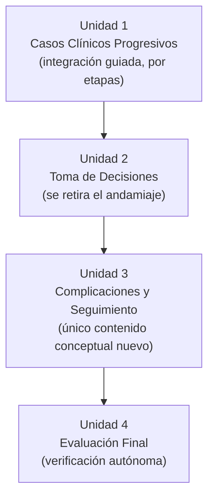
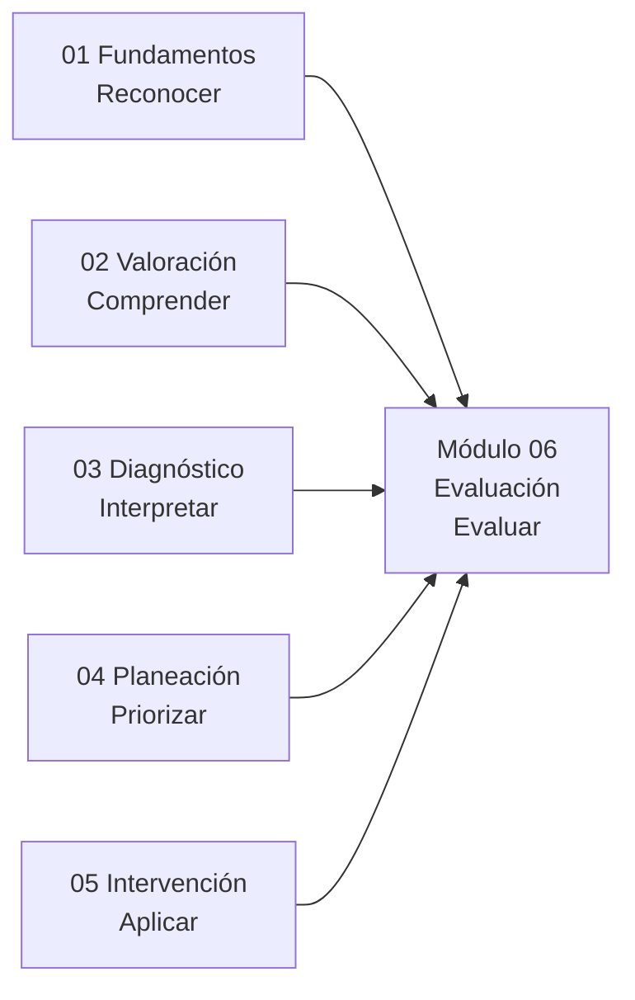

# Arquitectura Pedagógica — Módulo 06: Evaluación

## Objeto Virtual de Aprendizaje · Manejo Integral de Arritmias Cardíacas

---

## 1. Propósito de este documento

Explica **por qué** el Módulo 06 está diseñado como está. Hereda los fundamentos pedagógicos de `ARQUITECTURA-PEDAGOGICA-MODULO-01.md`. Aquí solo lo específico de este módulo.

El contenido clínico vive en `modules/modulo-06.html`.

---

## 2. Nivel de complejidad y competencia general

| | |
|---|---|
| **Nivel de complejidad del aprendizaje** | **Evaluar** |
| **Fase del Proceso de Atención de Enfermería** | Evaluación |
| **Pregunta que domina el pensamiento del estudiante** | **¿Funcionó?** |

Es el nivel más alto de la secuencia. El estudiante no aplica un procedimiento: **juzga un resultado contra un criterio**, reconoce cuándo la conducta elegida no funcionó y decide el siguiente paso.

**Competencia:** integrar las competencias de valoración, diagnóstico, planeación e intervención en la resolución de casos clínicos completos, evaluar la respuesta del paciente frente a los resultados esperados, reconocer las complicaciones frecuentes posteriores a la intervención y planificar el seguimiento correspondiente.

### 2.1 El límite honesto del recurso

Este es el módulo donde conviene hacer explícito, en el propio contenido, el límite del OVA.

Las versiones anteriores de la arquitectura situaban este módulo en el nivel «Experto» de Benner. Se retiró esa etiqueta (ver sección 2.1 del documento del Módulo 01) porque la pericia experta depende de experiencia clínica real acumulada, y ningún recurso digital la sustituye. Un estudiante que complete este módulo con nota máxima no es un experto en arritmias: es alguien que ha demostrado razonamiento clínico estructurado en escenarios simulados.

Decirlo dentro del módulo no debilita el proyecto — lo hace defendible. Y es coherente con lo que se afirma en el artículo del proyecto.

---

## 3. Mapa: Objetivo → Nivel de Bloom → Unidad → Evidencia de evaluación

| # | Objetivo de aprendizaje | Verbo / Nivel de Bloom | Unidad | Evidencia de evaluación |
|---|---|---|---|---|
| 1 | Integrar los conocimientos de los cinco módulos anteriores en casos clínicos progresivos | **Analizar / Evaluar** | Unidad 1 · Casos Clínicos Progresivos | Stepper Valorar → Diagnosticar → Planear → Intervenir |
| 2 | Tomar decisiones clínicas completas, de la valoración a la intervención, en un solo escenario | **Evaluar** | Unidad 2 · Toma de Decisiones | Escenarios sin andamiaje; simulador |
| 3 | Reconocer complicaciones frecuentes y planificar el seguimiento del paciente | **Analizar / Crear** | Unidad 3 · Complicaciones y Seguimiento | Reto de emparejar complicación↔vigilancia |
| 4 | Autoevaluar de forma integral el dominio del manejo de arritmias cardíacas | **Evaluar** | Unidad 4 · Evaluación Final | Autoevaluación de 8 preguntas |

### Sobre el número de preguntas

Este módulo tiene **4 objetivos y 8 preguntas** de autoevaluación. A diferencia de los Módulos 02-05, aquí el desbalance **no es una brecha**: la Unidad 4 es la evaluación sumativa de toda la OVA, no del módulo, y por tanto debe cubrir contenidos de los seis módulos. Ocho preguntas para cerrar un curso de treinta y tantas unidades es, si acaso, escaso.

**Recomendación:** verificar que las 8 preguntas cubran los seis módulos y no solo los dos últimos. Una evaluación final que solo pregunte por intervención y evaluación no verifica la integración que el módulo dice medir.

---

## 4. Justificación de la secuencia de las cuatro unidades

La secuencia va **de la integración guiada a la evaluación autónoma**, y es un ejemplo deliberado de retirada progresiva del andamiaje (*scaffolding fading*):

- **U1** presenta casos que se despliegan por etapas, con retroalimentación en cada una. El estudiante todavía está acompañado: el stepper le indica en qué fase del razonamiento se encuentra.
- **U1 → U2:** los mismos escenarios, sin la estructura por etapas. El estudiante debe reconocer por sí mismo en qué punto del razonamiento está.
- **U2 → U3:** se introduce el único contenido conceptual genuinamente nuevo del módulo — qué puede salir mal después de una intervención y cómo se vigila. Va aquí, y no antes, porque solo tiene sentido tras haber ejecutado intervenciones.
- **U3 → U4:** evaluación sumativa integradora, sin ayuda.

**Nota de diseño:** este es el único módulo del OVA cuya secuencia no está determinada por el contenido sino por **el grado de apoyo** que recibe el estudiante. Es una diferencia estructural respecto a los cinco anteriores y conviene señalarla en la sustentación: demuestra que la progresión pedagógica se pensó, no se heredó del temario.

---

## 5. Taxonomía NANDA / NOC / NIC

El syllabus **exige** explícitamente la taxonomía enfermera en este módulo. Aquí no es un requisito formal añadido: es funcionalmente necesario.

El **NOC es el instrumento que responde la pregunta que da nombre al módulo**. «¿Funcionó?» solo es contestable si antes se declaró un resultado esperado con un indicador medible. Sin NOC, la evaluación de la respuesta del paciente queda como impresión clínica no estructurada.

Cada caso debería cerrar con:

| Componente | Función en este módulo |
|---|---|
| **NANDA** | El diagnóstico enfermero que corresponde a la situación planteada |
| **NOC** | El resultado esperado y el indicador que permite juzgar si se alcanzó |
| **NIC** | Las intervenciones ejecutadas, con su código (4160, 4030, 4040 según el syllabus) |

> ⚠️ **Estado por verificar:** no se ha confirmado que `modules/modulo-06.html` implemente actualmente esta taxonomía. Es un requisito curricular explícito.

---

## 6. Microestructura pedagógica aplicada

| Paso de la plantilla | U1 Casos | U2 Decisiones | U3 Complicaciones | U4 Evaluación Final |
|---|---|---|---|---|
| 1. Fundamento científico | ➖ (se invoca lo aprendido) | ➖ | ✅ Único contenido nuevo | ➖ |
| 2. Interpretación clínica | ✅ | ✅ | ✅ | ✅ |
| 3. Aplicación práctica | ✅ | ✅ | ✅ | ✅ |
| 4. Toma de decisiones | ✅ Guiada | ✅ **Autónoma** | ✅ | ✅ |
| 5. Caso o simulación | ✅ **Es el contenido** | ✅ | ✅ | ✅ |
| Interacción activa | ✅ Stepper | ✅ Simulador | ✅ Emparejar | ✅ Autoevaluación |

**Diferencia respecto a todos los módulos anteriores:** el paso 1 (fundamento científico) está prácticamente ausente, y es correcto que lo esté. Este módulo no enseña temas nuevos salvo las complicaciones: **invoca**. Si una unidad de este módulo necesita explicar un concepto desde cero, probablemente ese concepto falta en el módulo donde correspondía.

El paso 5 deja de ser un instrumento entre otros y **se convierte en el contenido mismo**.

### 6.1 Recursos interactivos del módulo

Inventario real implementado en `modules/modulo-06.html`:

- **Stepper** (4 pasos): el recorrido Valorar → Diagnosticar → Planear → Intervenir, que es el andamiaje de la Unidad 1.
- **Retos de emparejar** (3 pares): complicación↔vigilancia.
- **Simulador**, para los escenarios de decisión.
- **Mini reto** (1).

**Observación:** junto con el Módulo 04, es el de menor densidad interactiva. En este caso preocupa menos, porque los casos clínicos progresivos cumplen la función que en otros módulos cumplen los widgets. Pero conviene verificar que los casos estén realmente construidos como experiencias interactivas y no como texto con preguntas al final.

---

## 7. Criterio de calidad de los casos clínicos

Los casos son el corazón de este módulo, y su calidad determina la del módulo entero. Tres criterios de validación:

**1. Coherencia interna.** Las cifras hemodinámicas deben corresponder al ritmo descrito, y la respuesta a la intervención debe ser plausible. Un caso incoherente enseña un patrón erróneo que el estudiante arrastrará a la práctica.

**2. Exigencia de los cinco módulos.** Cada caso debería requerir valorar (M02), nombrar el ritmo (M03), priorizar (M04), ejecutar (M05) y juzgar el resultado (M06). **Si un caso puede resolverse sin recurrir a alguno de esos módulos, está demasiado simplificado** para el nivel del módulo.

**3. Error deliberado.** Los mejores casos formativos provocan intencionadamente el error frecuente para después corregirlo con retroalimentación razonada. Un caso donde todas las decisiones sean obvias no evalúa razonamiento clínico.

---

## 8. Estrategia de evaluación

| Instrumento | Momento | Propósito | Nivel de Bloom |
|---|---|---|---|
| `key-box` / `key-box danger` (3 y 1) | Formativo, in-line | Refuerzo puntual | Comprender |
| Stepper de caso progresivo | Formativo, guiado | Integración con andamiaje | Analizar / Evaluar |
| Simulador en escenarios | Formativo, sin andamiaje | Decisión autónoma | Evaluar |
| Emparejar complicación↔vigilancia | Formativo | Asociación | Aplicar |
| Autoevaluación (**8** preguntas) | Cierre del curso | **Verificación sumativa de toda la OVA** | Analizar / Evaluar |

Es el único módulo cuya autoevaluación no verifica el módulo sino el curso completo. El modal de finalización (`finalizarModuloActual` en `js/13-shell-indice.js`) reconoce esta condición: al cerrar el Módulo 06 muestra «¡Curso completado!» en vez de proponer un módulo siguiente.

---

## 9. Brechas y acciones pendientes

| # | Brecha | Severidad | Acción |
|---|---|---|---|
| 1 | Taxonomía NANDA/NOC/NIC exigida por el syllabus, implementación sin verificar | 🔴 Alta | Auditar `modules/modulo-06.html` y añadirla si falta. Aquí es funcionalmente necesaria, no formal |
| 2 | Sin verificar que las 8 preguntas finales cubran los seis módulos | 🟡 Media | Revisar la cobertura de la autoevaluación final |
| 3 | Sin verificar que los casos cumplan el criterio 2 de la sección 7 | 🟡 Media | Revisar cada caso: ¿exige realmente los cinco módulos anteriores? |
| 4 | Densidad interactiva baja | 🟢 Baja | Aceptable si los casos son genuinamente interactivos |

---

## 10. Relación con el resto de la OVA

Este módulo **cierra** la OVA y no entrega a ningún módulo siguiente. Su función es distinta a la de todos los demás: no prepara, verifica.

Por eso su diagrama de relaciones no es lineal como el de los demás: **los cinco módulos anteriores confluyen aquí**.

**Criterio de validación del módulo — y de toda la OVA:** si un estudiante completa el Módulo 06 y no puede resolver un caso completo de principio a fin, la falla no está en este módulo. Este módulo es el instrumento que revela dónde está la falla, en cuál de los cinco anteriores. Su valor diagnóstico para el propio proyecto es tan importante como su valor formativo para el estudiante: los resultados de esta autoevaluación son la mejor fuente de datos para la mejora continua del OVA.
